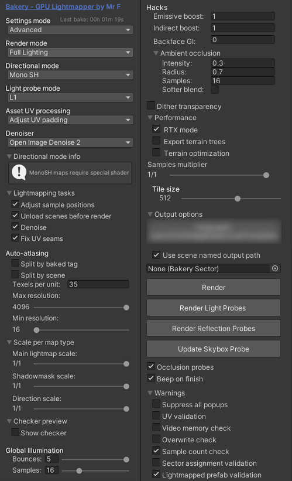

# ライティングの再ベイク

内装の改変やオブジェクトを追加した場合に、ライティングを再計算（ベイク）する手順です。

---

## Bakery でベイクする場合

Bakery - GPU Lightmapper をご使用の場合の推奨設定です。

1. メニューバーの **Bakery > Render Lightmap** を開きます。
2. Render Mode や Resolution をシーンの規模に合わせて調整します（既定値は同梱設定を参照）。
3. 「Render」を実行してベイクを完了させます。

!!! warning "VRC Light Volumes との併用"
    VRC Light Volumes を配置している場合、Bakery でのベイク完了後に VRC Light Volumes のプローブ生成・ベイク処理もあわせて実行してください。

---

## ビルトインライトマッパーでベイクする場合

Bakery をお持ちでない場合は、Unity 標準の Progressive CPU/GPU Lightmapper を使用します。

1. **Window > Rendering > Lighting** を開きます。
2. 「Scene」タブで Lightmapping Settings を確認します（Mixed Lighting, Progressive GPU 推奨）。
3. 「Generate Lighting」を押してベイクを開始します。
