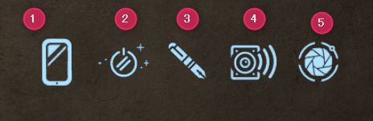
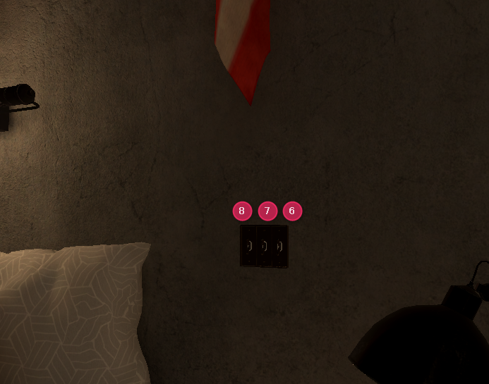
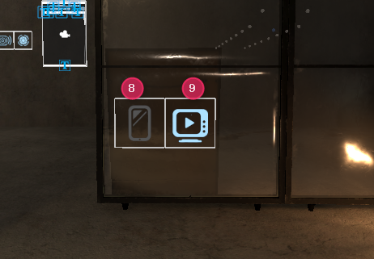

# ギミック一覧

ワールド内で動作する主なギミックです。

## 常時動作するもの

- ビデオプレイヤー
- 蛍光灯点滅
- テレポート
- リバーブゾーン（残響効果）
- ジョイン時のフェードイン
- ジョインサウンド（入室時効果音）
- ジョインログ（入室ログ表示）
- スカイボックス回転

## トグルボタン（ON / OFF 切り替え）

### メインパネル

1. 距離フェードミラー
2. パーティクル
3. QvPen
4. 環境音
5. ポストプロセッシング

### ベッド周り

6. ベッドコライダー
7. ベッドミラー
8. 掛け布団

### ミラー・ビデオ

- プレイヤーオンリーミラー
- ビデオプレイヤー

