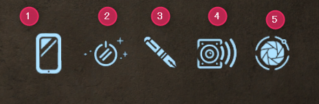
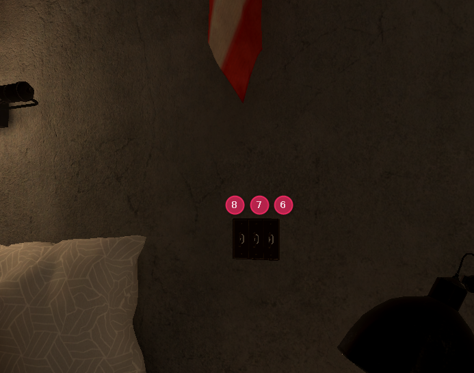
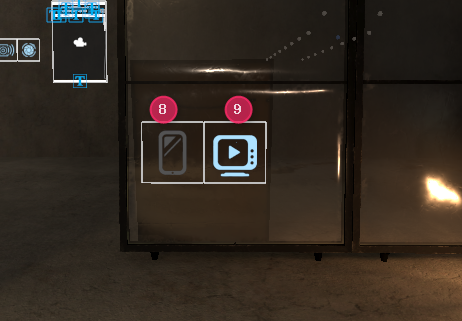

# ギミック一覧

ワールド内に配置されているインタラクティブギミックの一覧と操作仕様です。

---

## 常時動作ギミック

ワールド入室時から常に動作している基本機能です。

| ギミック | 動作内容 | 同期設定 |
|---|---|---|
| **入退室ログ** | プレイヤーが入室・退室した際の記録を壁面ボードに表示 | ローカル |
| **入室時フェードイン** | スポーン時に視界が暗転から滑らかに明転 | ローカル |
| **入室サウンド** | ワールド入室時に専用の効果音を再生 | ローカル |
| **蛍光灯の点滅** | 地下秘密基地の雰囲気を演出する間欠的な照明の明滅 | ローカル |
| **スカイボックス回転** | 背景の環境マップが緩やかに回転 | ローカル |
| **リバーブゾーン** | 部屋の構造（コンクリート地下室）に応じた声のリバーブ（残響）を付与 | ローカル |
| **テレポート** | ワールド内の指定地点へ瞬時に移動 | ローカル |

---

## 切り替えスイッチ（トグル操作）

ワールド内の各操作パネルから、プレイヤーが任意に ON / OFF を切り替えられるギミックです。

### メイン操作パネル

部屋の中央壁面に設置されているメインパネルです。

| ボタン番号 | 機能名 | 初期状態 | 同期仕様 | 説明 |
|:---:|---|:---:|:---:|---|
| **1** | 距離フェードミラー | OFF | ローカル | 近づいたときだけ映る負荷軽減型ミラー |
| **2** | パーティクル | ON | グローバル | 浮遊する空気中の塵やホコリの演出エフェクト |
| **3** | QvPen | ON | グローバル | 空中や壁に自由に描画できるペンギミック |
| **4** | 環境音 | ON | ローカル | 秘密基地内の空調音・環境音の再生 |
| **5** | ポストプロセッシング | ON | ローカル | 画面の色調補正・Bloom演出 |

### ベッド周りパネル

寝室エリア（ベッドサイド）に設置されている専用スイッチです。

| 番号 | 機能名 | 初期状態 | 同期仕様 | 説明 |
|:---:|---|:---:|:---:|---|
| **6** | ベッドコライダー | ON | ローカル | ベッドの上に座ったり寝転がったりできる当たり判定 |
| **7** | ベッドミラー | OFF | ローカル | ベッド正面の視界を確認できる専用ミラー |
| **8** | 掛け布団 | ON | グローバル | ベッドの掛け布団の表示／非表示切り替え |

### ミラー・VizVid

| 機能名 | 初期状態 | 同期仕様 | 説明 |
|---|:---:|:---:|---|
| **プレイヤーオンリーミラー** | OFF | ローカル | 背景を描画せず、アバターのみを高画質に映す軽量ミラー |
| **VizVid** | OFF | グローバル | YouTube 等の動画・ライブ配信を再生できるスクリーン |
