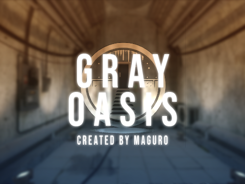

# GRAY OASIS

コンクリートの空間にプールと居住スペースを備えた VRChat ワールドです。

- 商品ページ: [BOOTH](https://maguro-vrc.booth.pm/items/5749183)

!!! info "このドキュメントについて"
    最新の内容はこのページで公開しています。価格・利用規約・サポート期間などの販売条件については、BOOTH の商品ページの記載が優先されます。

## 必要環境

| 項目 | 内容 |
|---|---|
| Unity | 2022.3.22f1 |
| VRChat SDK | Worlds SDK 3 |
| ライティング | Bakery - GPU Lightmapper でベイク済み。Bakery を持っていない場合はビルトインライトマッパー版を使用 |
| 主要シェーダー | Filamented Standard for Unity |

必須アセットの一覧と入手先は [導入](install.md) を参照してください。

!!! warning "追加ファイルのダウンロードが必要です"
    テクスチャなど容量の大きいアセットは外部クラウドストレージに置いています。同梱の「追加ファイルダウンロードリンク_v1.2.0.txt」に記載されたリンクから `GRAY_OASIS_Tex_Others.unitypackage` をダウンロードしてインポートしてください。

## ドキュメントの読み進めかた

1. [導入](install.md) — 必須アセットの用意からアップロードまで
2. [ギミック一覧](gimmicks.md) — ワールド内で操作できるもの
3. [使用アセット](credits.md) — 使用させていただいたアセットと配布元
4. [更新履歴](changelog.md)

## 利用について

VRChat のワールドとしてアップロードする以外の用途で使う場合は、同梱および使用アセットそれぞれの利用規約を必ず確認してください。
