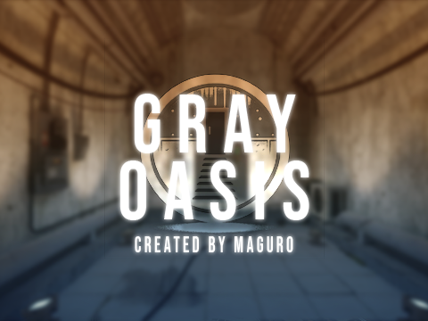

# GRAY OASIS

VRChat World

{ .product-icon }

地下の秘密基地をイメージした、重厚なインダストリアルデザインの VRChat 向けワールドです。コンクリートと鉄骨に囲まれた空間に、プール、居住スペース、多数のインタラクティブギミックを備えています。

- 商品ページ: [BOOTH](https://maguro-vrc.booth.pm/items/5749183)

## サンプルワールド

実際のワールド空間やライティング、ギミックの動作を VRChat 内で体験できます。

- [通常版（Bakery ベイク）](https://vrchat.com/home/world/wrld_a62dd01c-80ad-4bf6-a651-166a0a395482)
- [ビルトインライトマッパー版](https://vrchat.com/home/world/wrld_00fab39d-75bb-4b3f-b7a5-c948db3edf61)

## ギミック

ワールド内に設定されている主なギミックです。特記のないものは商品データにあらかじめ組み込まれています。

- [VizVid](https://github.com/JLChnToZ/VVMW) — 別途導入が必要
- [QvPen](https://vpm.ureishi.net/install) — 別途導入が必要
- [[VRCSDK3] Visitors Information Board](https://booth.pm/ja/items/5403376) — 別途導入が必要
- [VRC Light Volumes](https://github.com/REDSIM/VRCLightVolumes) — 別途導入が必要
- [Smart Mirror](https://booth.pm/ja/items/3292060)
- [VRCPlayersOnlyMirror](https://booth.pm/ja/items/2685621)
- メイン操作パネル（パーティクル、環境音、ポストプロセッシング等）
- ベッド周りスイッチ（ベッドコライダー、掛け布団、ベッド正面ミラー）
- 常時演出（蛍光灯の明滅、リバーブゾーン、フェードイン）

操作場所や同期仕様の詳細は [ギミック一覧](gimmicks.md) を参照してください。

## 必要環境・制作環境

| 項目 | 内容 |
|---|---|
| 制作時 Unity | Unity 2022.3.22f1 |
| 制作時 SDK | Worlds SDK 3（v1.2.0更新当時） |
| ワールド容量 | 約180MB |
| ライティング | [Bakery - GPU Lightmapper](https://assetstore.unity.com/packages/tools/level-design/bakery-gpu-lightmapper-122218?locale=ja-JP) でベイク済み（未所持の場合はビルトインライトマッパー版シーンを使用可能） |
| 主要シェーダー | [Filamented Standard for Unity](https://booth.pm/ja/items/3250389) |
| 必須アセット | QvPen / VizVid / VRC Light Volumes / Visitors Info Board / Mochies Shaders（詳細は[導入](install.md)） |
| プラットフォーム | PC 専用（Quest 実機での動作確認は行っていません） |

## ご購入・導入前の確認事項

- **ギミックの動作保証・互換性について**:
  本商品は制作時点の環境で動作確認を行っていますが、今後の最新 Worlds SDK 環境での継続的な追従アップデートは保証していません。
- **追加テクスチャのダウンロード（MEGA）**:
  高解像度テクスチャはファイル容量が大きいため、MEGAストレージに配置しています。購入データ同梱の「追加ファイルダウンロードリンク_v1.2.0.txt」に記載されたURLから取得してください。
- **Bakery の有無に応じたシーン選択**:
  Bakery をお持ちでない方は、同梱のビルトインライトマッパー版シーン（`GrayOasis_builtin.unity`）をご利用ください。
- **利用規約**:
  ワールドの利用条件は [利用規約](../terms.md) に準拠します。

## ドキュメント一覧

- [導入ガイド](install.md) — 必須アセットの準備、MEGAからのテクスチャ取得、シーンの展開とアップロード手順
- [ギミック一覧](gimmicks.md) — 各スイッチ・ミラー・ビデオプレイヤーの位置と操作仕様
- [ライティング調整](customize.md) — Bakery やビルトインでの再ベイク手順
- [トラブルシューティング](troubleshoot.md) — マテリアルのピンク化、暗い・テクスチャがぼやける等の解決策
- [使用アセット](credits.md) — 同梱・使用アセットのクレジット
- [更新履歴](changelog.md) — バージョン履歴
