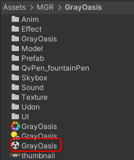
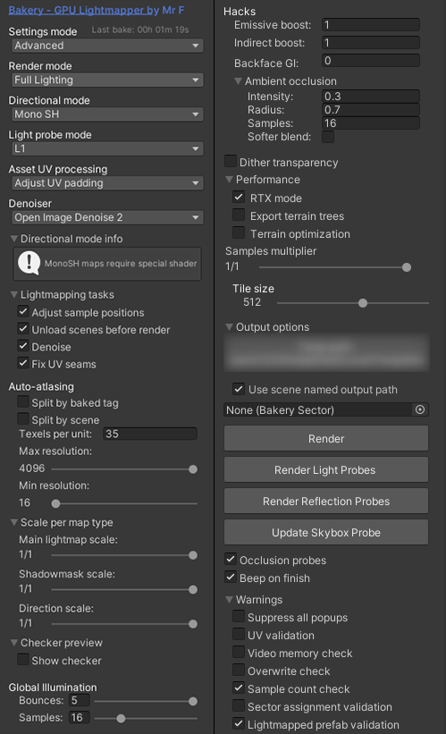

# 導入

## 1. プロジェクトを作成する

VRChat ワールド用の新規プロジェクトを作成します（Unity 2022.3.22f1）。

## 2. 必須アセットを導入する

ワールドが参照しているため、**すべて導入してください**。

| アセット | 入手先 |
|---|---|
| VizVid | <https://xtlcdn.github.io/vpm/> |
| QvPen | <https://vpm.ureishi.net/install> |
| VRC Light Volumes | [REDSIM/VRCLightVolumes](https://github.com/REDSIM/VRCLightVolumes) |
| [VRCSDK3] Visitors Information Board | [BOOTH](https://booth.pm/ja/items/5403376) |
| Mochies-Unity-Shaders | [MochiesCode/Mochies-Unity-Shaders](https://github.com/MochiesCode/Mochies-Unity-Shaders) |
| Bakery - GPU Lightmapper | [Unity Asset Store](https://assetstore.unity.com/packages/tools/level-design/bakery-gpu-lightmapper-122218?locale=ja-JP) |

!!! note "Bakery を持っていない場合"
    `GRAY_OASIS_builtinLightmapper.unitypackage` をインポートしてください。ビルトインライトマッパーでベイクしたシーンが入っています。

!!! warning "Bakery と VRC Light Volumes の組み合わせ"
    2025年5月23日時点で、VRC Light Volumes に対応している Bakery は [Git から取得する最新バージョン](https://geom.io/bakery/wiki/index.php?title=Github_access) のみです。

## 3. GRAY OASIS をインポートする

次の2つをインポートします。

1. `GRAY_OASIS.unitypackage` または `GRAY_OASIS_builtinLightmapper.unitypackage`
2. `GRAY_OASIS_Tex_Others.unitypackage`（同梱の「追加ファイルダウンロードリンク_v1.2.0.txt」のリンクから取得）

## 4. シーンを開く

`Assets > MGR > GrayOasis > GrayOasis.unity` を開きます。

!!! note "ライトマップの参照が外れている場合"
    再度ライトマップのベイクを行ってください。

## 5. Bakery の設定

ベイクし直す場合は、次の設定でベイクしています。

## 6. アップロードする

VRChat にログインし、ワールドのタイトル・説明・サムネイルなどを入力して「Build and Upload」を実行します。
