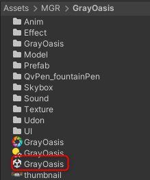

# 導入

新規のワールドプロジェクトへの導入手順です。[必要環境](index.md)を確認してから始めてください。

STEP 1
<h3>プロジェクトを作成する</h3>

VCC（VRChat Creator Companion）または ALCOM から、VRChat ワールド用の新規プロジェクトを作成します（Unity 2022.3.22f1）。

STEP 2
<h3>必須アセットを導入する</h3>

ワールド内のギミックやシェーダーが参照しているため、パッケージをインポートする前にすべて導入してください。

| アセット | 用途 | 入手先 |
|---|---|---|
| VizVid | ビデオプレイヤー | [VPMリポジトリ](https://xtlcdn.github.io/vpm/) |
| QvPen | ペンギミック | [VPMリポジトリ](https://vpm.ureishi.net/install) |
| VRC Light Volumes | アバターライティング | [GitHub](https://github.com/REDSIM/VRCLightVolumes) |
| Visitors Information Board | 入退室ログ表示 | [BOOTH](https://booth.pm/ja/items/5403376) |
| Mochies-Unity-Shaders | 水・エフェクト等シェーダー | [GitHub](https://github.com/MochiesCode/Mochies-Unity-Shaders) |
| Bakery - GPU Lightmapper | ライティングベイク（任意） | [Unity Asset Store](https://assetstore.unity.com/packages/tools/level-design/bakery-gpu-lightmapper-122218?locale=ja-JP) |

!!! tip "Bakery をお持ちでない場合"
    Bakery を未所持でも問題ありません。ビルトインライトマッパーでベイク済みのシーンパッケージ（`GRAY_OASIS_builtinLightmapper.unitypackage`）を同梱しています。

STEP 3
<h3>追加テクスチャをダウンロードする</h3>

高解像度テクスチャはファイルサイズが大きいため、MEGAストレージに配置しています。
購入データに同梱されている「**追加ファイルダウンロードリンク_v1.2.0.txt**」を開き、記載されたURL（MEGA）から `GRAY_OASIS_Tex_Others.unitypackage` をダウンロードしてください。

STEP 4
<h3>unitypackage をインポートする</h3>

次の順番でプロジェクトへインポートします。

1. **本体パッケージ**:
   - Bakery をお持ちの場合 ➔ `GRAY_OASIS.unitypackage`
   - Bakery をお持ちでない場合 ➔ `GRAY_OASIS_builtinLightmapper.unitypackage`
2. **テクスチャパッケージ**:
   - STEP 3 で取得した `GRAY_OASIS_Tex_Others.unitypackage`

STEP 5
<h3>シーンを開く</h3>

Project ウィンドウから次のシーンを開きます。

- Bakery版: `Assets/MGR/GrayOasis/GrayOasis.unity`
- ビルトイン版: `Assets/MGR/GrayOasis/GrayOasis_builtin.unity`

STEP 6
<h3>動作確認とアップロード</h3>

1. Unity の Play モード（ClientSim）に入り、スポーン位置、ライティング、ギミックの動作を確認します。
2. 問題がなければ、VRChat SDK コントロールパネルの「Builder」タブからワールドのタイトル・説明文・サムネイル画像を設定し、「Build and Upload」を実行します。

