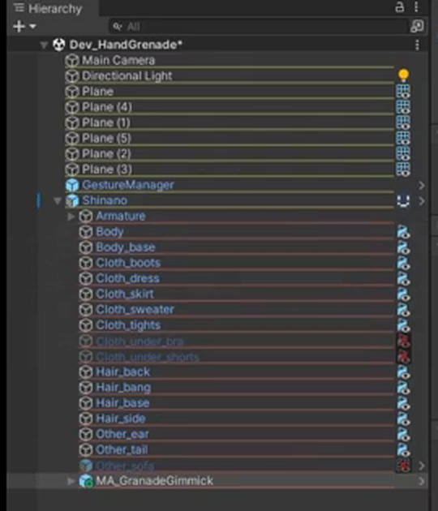
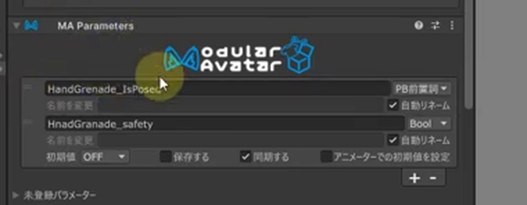
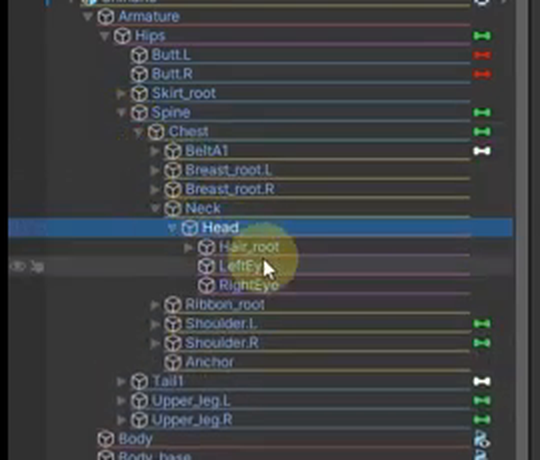
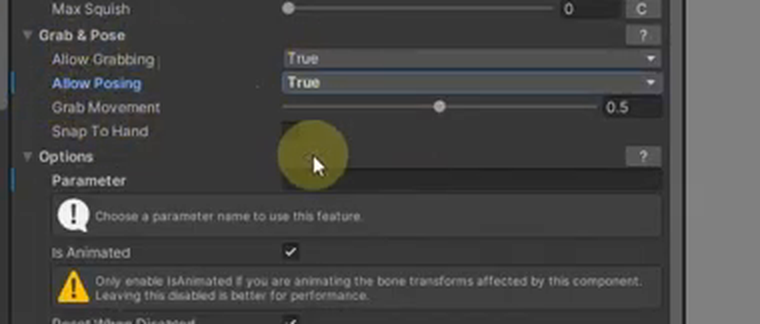
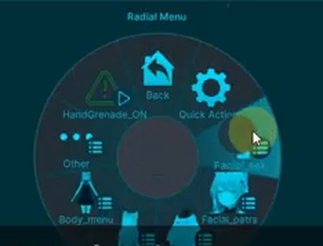

# 導入

同じ内容を動画でも公開しています。

<https://youtu.be/VFBRsUQBYxI>

## 1. 必須アセットを導入する

- [Modular Avatar](https://modular-avatar.nadena.dev/ja)
- [lilToon](https://lilxyzw.github.io/lilToon/)

## 2. Prefab をアバター直下に配置する

`MA_GranadeGimmick` をアバターの直下に置きます。

## 3. パーティクルの発生位置を調整する

配置した **`MA_GranadeGimmick` 自体の Transform** を動かして、手榴弾のエフェクトが出る位置をアバターに合わせます。子オブジェクトではなく、この Prefab のルートを動かしてください。

## 4. パラメータ名をコピーする

配置した `MA_GranadeGimmick` を選び、Inspector の MA Parameters にある **PB前置詞** のパラメータ名をコピーします。

## 5. 発火させたい PhysBone を選ぶ

掴んで固定したときにギミックを動かしたい PhysBone を、ヒエラルキーで選択します。スカートやアホ毛など、掴みやすいものが向いています。

## 6. PhysBone を設定する

選んだ PhysBone のコンポーネントで、次の3つを設定します。

| 場所 | 項目 | 値 |
|---|---|---|
| Grab & Pose | Allow Grabbing | True |
| Grab & Pose | Allow Posing | True |
| Options | Parameter | 手順4でコピーしたパラメータ名を貼り付け |

以上で導入は完了です。

## 動作を確認する

Play モードで確認できます。

**1. セーフティを解除する**

アバターのメニューから `HandGrenade_ON` を ON にします。誤爆防止のため、既定では OFF です。

**2. PhysBone を掴んで固定する**

GameView で右クリックして設定した PhysBone を掴み、左クリックで固定します。固定するとパーティクルと音が発生します。

!!! warning "使う場所と状況に配慮してください"
    このギミックは音とパーティクルエフェクトが発生します。周囲の人の迷惑にならない範囲で使用してください。使い終わったらメニューの `HandGrenade_ON` を OFF に戻しておくと、意図しない発火を防げます。
