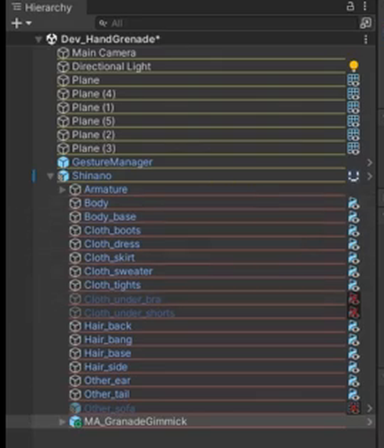
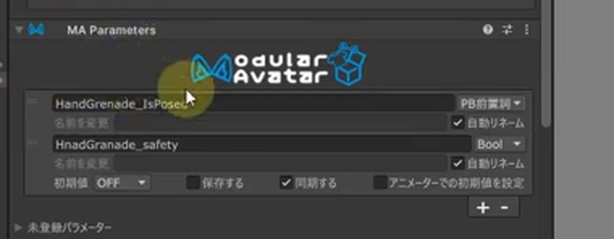
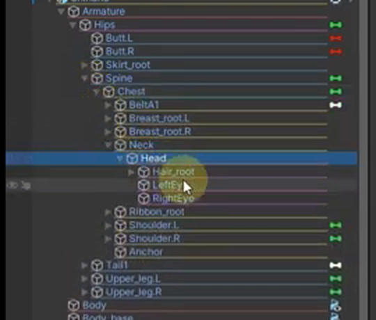
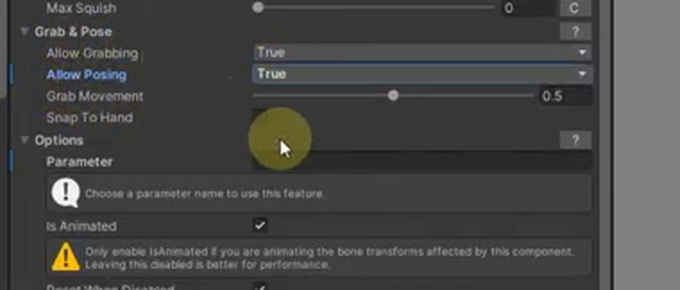
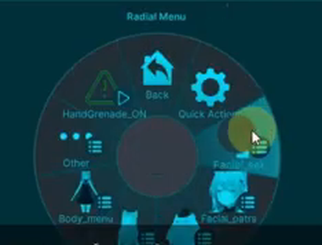

# 導入

Modular Avatar を使用したアバターへの導入手順です。[必要環境](index.md)を確認してから始めてください。

同じ手順を動画でもご確認いただけます。

<https://youtu.be/VFBRsUQBYxI>

STEP 1
<h3>必須アセットを導入する</h3>

VCC / ALCOM から次の2つのパッケージをアバタープロジェクトに追加します。

- [Modular Avatar](https://modular-avatar.nadena.dev/ja)
- [lilToon](https://lilxyzw.github.io/lilToon/)

STEP 2
<h3>Prefab をアバター直下に配置する</h3>

Project ウィンドウから `MA_GranadeGimmick` Prefab を、アバターのルートオブジェクト直下にドラッグ＆ドロップして配置します。

STEP 3
<h3>パーティクルの発生位置を調整する</h3>

配置した **`MA_GranadeGimmick` 自体の Transform** を動かして、手榴弾のエフェクトが出る位置をアバターの体格に合わせます。子オブジェクトではなく、この Prefab のルートを動かしてください。

STEP 4
<h3>パラメータ名をコピーする</h3>

配置した `MA_GranadeGimmick` を選択し、Inspector の MA Parameters にある **PBプレフィックス** のパラメータ名をクリップボードにコピーします。

STEP 5
<h3>発火させたい PhysBone を選ぶ</h3>

掴んで固定したときにギミックを動かしたい PhysBone（スカート、リボン、アホ毛など）を、Hierarchy で選択します。

STEP 6
<h3>PhysBone のパラメータを設定する</h3>

選択した PhysBone コンポーネントで、次の3項目を設定します。

| 場所 | 項目 | 設定値 |
|---|---|---|
| **Grab & Pose** | Allow Grabbing | **True**（チェックを入れる） |
| **Grab & Pose** | Allow Posing | **True**（チェックを入れる） |
| **Options** | Parameter | **STEP 4 でコピーしたパラメータ名を貼り付け** |

これで設定は完了です。

STEP 7
<h3>Play モードで動作を確認する</h3>

1. **セーフティを解除する**:
   アバターのエクスプレッションメニューから `HandGrenade_ON` を ON にします（誤操作防止のため初期状態は OFF です）。
   

2. **PhysBone を掴んで固定する**:
   Game ビューで設定した PhysBone をマウスの右クリックで掴み、そのまま左クリックして固定（Posing）します。固定と同時に手榴弾の音とエフェクトが発生すれば成功です。

!!! warning "周囲の環境に配慮してください"
    音と光のエフェクトが発生します。周囲の迷惑にならない範囲でご使用ください。使い終わったらメニューの `HandGrenade_ON` を OFF に戻しておくことを推奨します。

