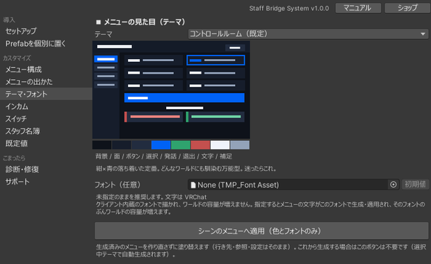

# 見た目のカスタマイズ

メニューの配色とフォントは、セットアップウィンドウの **カスタマイズ ＞ テーマ・フォント** ページ から変更します。

テーマを選ぶと、その場でミニプレビューが更新されます。下の帯は左から **背景／面／ボタン／選択／発話／退出／文字／補足** の役割色です。

## テーマを選ぶ

同梱プリセットは9種類です。選択すると、実機と同じ比率のミニプレビューで配色を確認できます。

下の表の配色見本は、左から **背景／面／ボタン／選択／文字** です（セットアップウィンドウに出る見本と同じ並び順）。「選択」はタブや現在地のハイライトに使われ、そのテーマの性格を決める色です。

### 暗色

| テーマ | 配色 | 特徴 |
|---|---|---|
| コントロールルーム（既定） | <i style="background:#0D1119"></i><i style="background:#161D2B"></i><i style="background:#222C3F"></i><i style="background:#3D8BFF"></i><i style="background:#EFF3FA"></i> | 紺 × 青。癖がなく馴染みやすい |
| バックステージ | <i style="background:#131211"></i><i style="background:#1E1C19"></i><i style="background:#262421"></i><i style="background:#FFC933"></i><i style="background:#F7F5F0"></i> | 炭黒 × イエロー。視認性が最も高い |
| トワイライト | <i style="background:#181729"></i><i style="background:#232138"></i><i style="background:#302D4B"></i><i style="background:#A99BE8"></i><i style="background:#F2F0FA"></i> | 藍紫。当たりがやわらかい |
| ランタン | <i style="background:#1C1613"></i><i style="background:#281F1A"></i><i style="background:#362A22"></i><i style="background:#F0913D"></i><i style="background:#F7F0E8"></i> | 提灯・焚き火のような暖色 |
| オーシャン | <i style="background:#101820"></i><i style="background:#182430"></i><i style="background:#24333F"></i><i style="background:#3EC6DE"></i><i style="background:#EDF4F8"></i> | 深青 × シアン。水中のような涼しい印象 |
| いちごショコラ | <i style="background:#241318"></i><i style="background:#311C24"></i><i style="background:#402731"></i><i style="background:#F291B4"></i><i style="background:#FAF2F0"></i> | ショコラ × いちごのかわいい系 |
| グラファイト | <i style="background:#141518"></i><i style="background:#1F2126"></i><i style="background:#2A2D33"></i><i style="background:#E8EAEE"></i><i style="background:#EDEFF2"></i> | 黒 × 白のミニマル。無彩色 |

### 明色

| テーマ | 配色 | 特徴 |
|---|---|---|
| ギャラリー | <i style="background:#ECE9E2"></i><i style="background:#F7F5F0"></i><i style="background:#DDD7CA"></i><i style="background:#2D5C8F"></i><i style="background:#26292E"></i> | 紙白 × 深藍。美術館のキャプション風 |
| ストロベリークリーム | <i style="background:#F6EDE6"></i><i style="background:#FBF6F1"></i><i style="background:#EBDBD2"></i><i style="background:#D96A93"></i><i style="background:#3A2E2C"></i> | 生クリーム × いちご |
| スノー | <i style="background:#F2F3F5"></i><i style="background:#FAFBFC"></i><i style="background:#E0E3E7"></i><i style="background:#3A3F46"></i><i style="background:#23262B"></i> | 白 × 炭のミニマル。無彩色 |

### 色覚配慮

| テーマ | 配色 | 特徴 |
|---|---|---|
| カラーユニバーサル | <i style="background:#12151A"></i><i style="background:#1B2028"></i><i style="background:#2A3038"></i><i style="background:#E9EDF2"></i><i style="background:#EDF1F6"></i> | 発話＝青・OFF＝橙。誰が使うか分からない常設ワールド向け |

他のテーマは発話＝緑・OFF＝赤ですが、この2色は最も多い赤緑型では見分けにくいため、このテーマだけ意味色を青×橙へ置き換えています。選択中の表示も、色相ではなく明るさで分かるように無彩色にしてあります。

## 配色を自分で決める（カスタム）

テーマ一覧の「カスタム（色を自分で決める）」を選ぶと、役割色12色を個別に編集できます。プリセットを起点にして一部だけ変えることもできます。

役割色の意味はテーマをまたいで固定されています。

| 役割 | 用途 |
|---|---|
| 背景 / 面 / ボタン | 地の色 |
| 選択（アクセント） | 選択中・現在地・タブ |
| 発話（Success 系） | 送信・確定 |
| 退出（Danger 系） | OFF・退出 |
| 本文 / 見出し | 文字色 |

発話ボタンと退出ボタンは「ボタンの地色 ＋ 左端の意味色の帯 ＋ 意味色の文字」で構成されます。彩度の高い塗りが並ぶとフッターだけテーマから浮くためです。**送信は緑系・退出は赤系**という意味色は、カラーユニバーサル（青 × 橙）を除いてどのテーマでも共通なので、テーマを変えても操作感は変わりません。

## フォントを差し替える { #font }

既定では、前提パッケージの日本語フォント（VRChat のフォールバックと同じ NotoSansJP）が使われます。指定なしのままで日本語が表示されるので、フォントの用意は不要です。

差し替えたい場合は、同じ画面の「フォント（任意）」に TMP フォントアセットを指定すると、生成されるテキストにそのフォントが使われます。色テーマとは独立した設定なので、どのテーマとも組み合わせられます。

!!! warning "レイアウトは既定フォント前提です"
    メニューの余白と文字サイズは既定フォントに合わせて詰めてあります。差し替えた場合の見た目は保証しません。文字幅や縦メトリクスが違うフォントでは、文字のはみ出しや上下のずれが出ることがあります。差し替えるときは実機で表示を確認してください。

## 生成済みのメニューに適用する

**「シーンのメニューへ適用（色とフォントのみ）」** を押すと、すでに配置してあるメニューを作り直さずに塗り替えます。テレポート先・参照・各種設定はそのまま保持されます。

これから新しく生成する場合は、このボタンは不要です（選択中のテーマで生成されます）。

!!! warning "プレイモード中は使えません"
    プレイ中の変更はプレイ終了時に元へ戻ってしまうため、ボタンは無効化されます。プレイモードを終了してから実行してください。

!!! note "手塗りした色について"
    塗り替えはテーマの色と一致する要素だけを対象にします。生成時と別の色を手動で塗った要素は変更されません。
