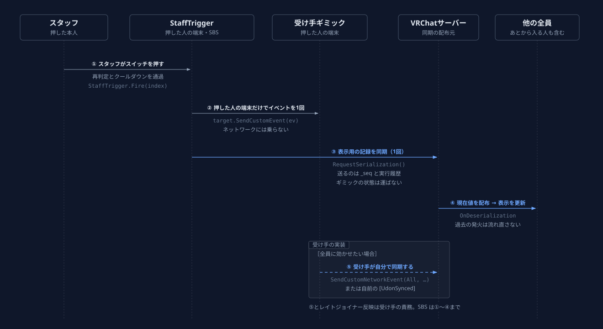

# 自作ギミックとつなぐ

UdonSharp や Udon Graph で自作ギミックを書く方向けのページです。コードを書かずに使う場合は [設定リファレンス](reference.md) だけで足ります。

外部連携の入口は2つです。

- **スイッチ（StaffTrigger）** — SBSメニューから自作ギミックへイベントを送る（SBS → 自作）
- **StaffRegistry** — 自作ギミックからスタッフ判定を読む・変化を受け取る（自作 → SBS）

ここに載せているクラス名・メソッド名・フィールド名は、出荷のたびに前バージョンとの互換を機械検査しています。

## スイッチの発火は「押した人のクライアントでローカル1回」 { #fire-contract }

ボタンを押すと、押した人のクライアントで発火先の UdonBehaviour に `SendCustomEvent` が1回呼ばれます。SBS がやるのはここまでです。

- 引数は渡せません（SendCustomEvent の仕様）
- 他のクライアントでは実行されません。SBS は発火先の Owner も変更しません
- 発火の直前にスタッフ判定を再チェックし、連打は 0.7 秒のクールダウンで弾きます
- 「誰がいつどのスイッチを押したか」の表示だけは SBS 側でグローバル同期し、レイトジョイナーにも見えます
- グローバルにするかどうかは発火先の実装が決めます
- 全員のクライアントで実行する発火はありません。同期する受け側と組み合わさると、全員が Owner を取り合って人数ぶんの同期が走るためです
- ネットワークに乗るのは「押した記録」と「受け手の同期変数」の2つだけ。人数が増えても送信コストは変わりません



## グローバルにするなら、イベントを配らず状態を書く { #make-it-global }

受け側は、イベントを配るのではなく `[UdonSynced]` に状態を書きます。

- 同期変数の現在値は、レイトジョイナー・入り直しにも届きます（[Late Joiners](https://creators.vrchat.com/worlds/udon/networking/late-joiners/)）
- `SendCustomNetworkEvent(All, ...)` はその瞬間にいた人にしか届かず、レイトジョイナーには再生されません（[Network Events](https://creators.vrchat.com/worlds/udon/networking/events/)）。状態を持つギミックには不向きです
- 書き込み前に SetOwner で所有権を取ります。Owner が退室しても所有権は自動で移り（[Ownership](https://creators.vrchat.com/worlds/udon/networking/ownership/)）、値は保たれます

GameObject の出し入れなら、同梱の [StaffObjectToggle](reference.md#object-toggle)（同期する=ON）がこの作りです。自作するときの骨組みは次のとおりです。

```csharp
using UdonSharp;
using UnityEngine;
using VRC.SDKBase;

[UdonBehaviourSyncMode(BehaviourSyncMode.Manual)]
public class GateReceiver : UdonSharpBehaviour
{
    public GameObject gate;

    [UdonSynced] private bool _open;

    // スイッチの「イベント名」にはこのメソッド名を書く（押した人のクライアントでだけ呼ばれる）
    public void OpenGate()
    {
        _open = true;
        Apply();

        // 押した人が Owner を取って状態を配る。レイトジョイナーには現在値が自動で届く
        var lp = Networking.LocalPlayer;
        if (!Utilities.IsValid(lp)) return;
        if (!Networking.IsOwner(gameObject)) Networking.SetOwner(lp, gameObject);
        RequestSerialization();
    }

    public override void OnDeserialization()
    {
        Apply();
    }

    private void Apply()
    {
        if (Utilities.IsValid(gate)) gate.SetActive(_open);
    }
}
```

!!! warning "Owner を取った直後の1回は配られないことがあります"
    移譲が済む前の RequestSerialization は落ちることがあり、初めて押した人の変化だけ伝わらない形で現れます。同梱の StaffObjectToggle は 0.5 秒後にもう一度呼んで防いでいます。

ローカルのままでよいのは、押した本人にだけ見せるもの（確認用の表示など）です。

## 効果はスタッフ以外にも届く { #affects-everyone }

スタッフ限定なのは「押せる人」だけです。受け側がグローバルに反映する実装なら、スタッフ以外を含む全員の画面が変わります。入場ゲート・照明・演出の切り替えに使えます。

## 重要な操作は受け側でも検証する { #validate-on-receiver }

Udon のイベントはエントリポイントとして公開されるため、スイッチ以外からも呼べます。入退場のロック解除のような重大な操作は、受け側でもスタッフ判定を確認してください。

```csharp
using MGR.StaffBridgeSystem;

public StaffRegistry registry; // Inspector で割り当てる

public void Unlock()
{
    if (!Utilities.IsValid(registry) || !registry.IsLocalStaff()) return;
    // ここから先が本処理
}
```

## スタッフ判定を読む・変化を受け取る（StaffRegistry） { #registry-api }

| メンバー | 内容 |
|---|---|
| `bool IsLocalStaff()` | 自分がスタッフか |
| `bool IsStaff(VRCPlayerApi player)` / `bool IsStaffId(int playerId)` | 指定プレイヤーがスタッフか |
| `int StaffCount()` | 現在のスタッフ人数 |
| `void Register(UdonSharpBehaviour listener)` | 通知先として登録する。登録直後に一度、以後は変化のたびに `_OnStaffStateChanged` が届く |

その場の判定だけなら `IsLocalStaff()` で足ります。登録するのは、スタッフの増減に反応したいときだけです。

```csharp
using MGR.StaffBridgeSystem;
using UdonSharp;
using UnityEngine;

[UdonBehaviourSyncMode(BehaviourSyncMode.None)]
public class StaffLamp : UdonSharpBehaviour
{
    public StaffRegistry registry; // Inspector で割り当てる
    public GameObject lamp;

    private void Start()
    {
        registry.Register(this); // 登録直後に現在状態が一度通知される
    }

    public void _OnStaffStateChanged()
    {
        lamp.SetActive(registry.IsLocalStaff());
    }
}
```

登録数の上限は128個です。超えた分は登録されず、Console にエラーが出ます。

## 制約 { #limits }

| 項目 | 内容 |
|---|---|
| スイッチの表示上限 | 20件。超過分はスイッチタブに出ません |
| StaffTrigger の数 | 1シーンに1個。複数あるとメニューの作り直しが中止されます |
| イベント名 | 文字列指定のため、間違ってもコンパイルエラーになりません。診断（健全性チェック）が発火先にその名前が実在するかを検査します |
| 作り直しの引き継ぎ | メニューの作り直し・再生成で、スイッチの配線は自動で引き継がれます |
| 配線の退避 | スイッチページの「設定を書き出し (.asset)」で配線一式を保存できます |
| 発火先の型 | `VRC.Udon.UdonBehaviour`。UdonSharp 製・Udon Graph 製のどちらも指定できます |

## 公式リファレンス { #official-refs }

同期の説明は VRChat 公式の次のドキュメントに基づいています。

- [Networking 全般](https://creators.vrchat.com/worlds/udon/networking/)
- [同期変数と Manual Sync（RequestSerialization / OnDeserialization）](https://creators.vrchat.com/worlds/udon/networking/variables/)
- [ネットワークイベント（SendCustomNetworkEvent）](https://creators.vrchat.com/worlds/udon/networking/events/)
- [Ownership（SetOwner・退室時の自動移転）](https://creators.vrchat.com/worlds/udon/networking/ownership/)
- [レイトジョイナーの扱い](https://creators.vrchat.com/worlds/udon/networking/late-joiners/)
- [UdonSharp の属性（UdonBehaviourSyncMode）](https://creators.vrchat.com/worlds/udon/udonsharp/attributes/)
