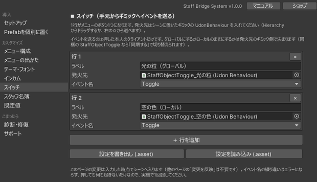
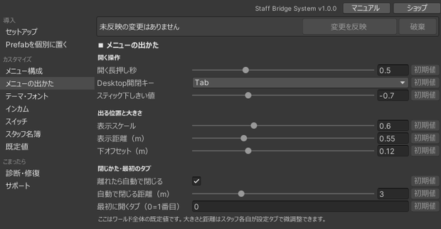
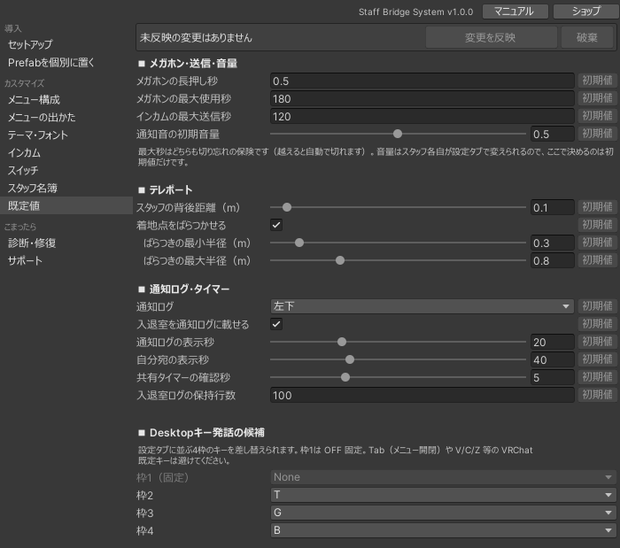

# やりたいことから探す

「こうしたい」から、触る場所を引くためのページです。詳しい説明は各リンク先にあります。

よく使う設定は、**セットアップ窓の「カスタマイズ」グループ**にまとめてあります。まずはそこを見てください。Inspector を開く必要があるのは、めったに触らない項目だけです。

表記の見かた：

- **セットアップ窓** = メニューバーの `Tools ＞ MGR ＞ Staff Bridge System ＞ セットアップ`
- **メニュー** = ワールド内でスタッフの手元に出るメニュー
- 「◯◯ページ」= セットアップ窓の左サイドバーで選ぶページ
- 「Inspector」と書いてある行は、対象のコンポーネントを選択して設定します

## カスタマイズの各ページでできること

| ページ | 内容 |
|---|---|
| メニュー構成 | タブの並べ替えと ON / OFF、メニューの作り直し、テレポート先の編集、定型文編集、ノート編集 |
| メニューの出かた | 開く長押し秒・Desktop開閉キー・スティックのしきい値、表示スケール／距離／下オフセット、自動で閉じる距離、最初に開くタブ |
| テーマ・フォント | 配色テーマの選択、カスタム色、フォント、生成済みメニューへの再着色 |
| インカム | チャンネル数（2〜12）の変更、各チャンネルの表示名、スタッフ限定モード・送信解除の待ち秒・ジェスチャー発話、インカムの一時停止 |
| スタッフ名簿 | 最初からスタッフにしておく人の編集、`.asset` への書き出し／読み込み |
| 既定値 | メガホンの長押し秒・最大使用秒、インカムの最大送信秒、通知音の初期音量、通知ログ・共有タイマー・入退室ログの既定値、DTキー発話の候補 |

!!! info "いつシーンに反映されるか"
    各ページの入力は**下書き**です。上部に固定されているバーの **変更を反映** を押すまで、シーンは変わりません。下書きが入っている欄には `*` が付き、バーに件数が出ます。

    反映は `Ctrl+Z` 一回でまとめて取り消せます。反映したあと、シーンの保存（`Ctrl+S`）とワールドの再アップロードは別途必要です。

    作り直しを伴うもの（チャンネル数の変更、テーマの再着色、テレポート先とプリセットの編集窓）は下書きにできないため、それぞれのボタンで即時に実行されます。

## メニューの構成 { #menu-config }

| やりたいこと | 触る場所 |
|---|---|
| 使わないタブを消したい | メニュー構成ページ ＞ 各行のチェックを外す → **この構成でメニューを作り直す**（「設定」タブは常に ON） |
| タブの並び順を変えたい | メニュー構成ページ ＞ 行をドラッグして並べ替え → **この構成でメニューを作り直す** |
| 作り直すと設定が消えないか知りたい | テレポート先・チャンネル名・定型文・ノートの内容・スイッチの設定・既定値・メニューの位置は引き継がれます。メニュー自体は新しいオブジェクトになるため、外部から参照している場合は貼り直しが必要です |
| ノートの内容を書き換えたい | メニュー構成ページ ＞ **ノート編集を開く**（ページの追加・並べ替え・本文の編集。最大6ページ） |
| スイッチの発火先を決めたい | スイッチページ ＞ **＋ 行を追加** → ラベル／発火先／イベント名 を入れる（発火先だけはヒエラルキーからドラッグ、または右の◎から選ぶ） |
| スイッチでオブジェクトを出し入れしたい | 同梱の `StaffObjectToggle` を空のオブジェクトに付け、**対象**に出し入れしたい GameObject を入れる。スイッチページの発火先にそれを指定し、イベント名を `Toggle`（`TurnOn` / `TurnOff` も可）にする |
| 共有タイマーの2回押しの猶予を変えたい | 既定値ページ ＞ **共有タイマーの確認秒**（既定 5） |
| 入退室ログの保持件数を変えたい | 既定値ページ ＞ **入退室ログの保持行数**（既定 100） |
| 通知ログの既定位置を変えたい | 既定値ページ ＞ **通知ログの位置**（各自が設定タブで上書きできます） |
| 入退室を通知ログに出したくない | 既定値ページ ＞ **入退室を通知ログに載せる** を OFF |

## メニューの出かた・見た目

| やりたいこと | 触る場所 |
|---|---|
| 配色を変えたい | テーマ・フォントページ→ [カスタマイズ](customize.md) |
| フォントを変えたい | 同じ場所の **フォント（任意）**。未指定なら日本語フォントが使われる → [カスタマイズ](customize.md#font) |
| 配置済みのメニューに色だけ反映したい | 同じ場所の **シーンのメニューへ適用（色とフォントのみ）** |
| 開くキーを Tab 以外にしたい | メニューの出かたページ ＞ **Desktop開閉キー**（Tab / F1〜F4 / B / G / N）→ [リファレンス](reference.md#menu-shell) |
| 開くまでの長押しを短く／長くしたい | メニューの出かたページ ＞ **開く長押し秒**（既定 0.5） |
| VR で開きにくい／勝手に開く | メニューの出かたページ ＞ **スティック下しきい値**（既定 -0.7。-1 に近いほど深く倒す） |
| メニューが大きすぎる・見切れる | メニューの出かたページ ＞ **表示スケール**（既定 0.6）。0.75 を超えると Desktop で下端が切れやすい |
| もっと近く／遠くに出したい | メニューの出かたページ ＞ **表示距離**（既定 0.55m） |
| 正面の視界を空けたい | メニューの出かたページ ＞ **下オフセット**（既定 0.12m） |
| 開いたメニューが置きっぱなしになる | メニューの出かたページ ＞ **離れたら自動で閉じる** と **自動で閉じる距離**（既定 3m） |
| 最初に開くタブを変えたい | メニューの出かたページ ＞ **最初に開くタブ**（0 = 1番目）。2回目以降は前回のタブが開く |

個人ごとの大きさ・距離は、各自がメニューの[設定タブ](usage.md#settings)からも調整できます（ワールド側の値に倍率が掛かります）。

## スタッフの付与・管理

| やりたいこと | 触る場所 |
|---|---|
| 決まったメンバーを自動でスタッフにしたい | スタッフ名簿ページ（1行に1人・表示名の完全一致）→ [運用ガイド](operation.md#staff-detection) |
| 名簿を別ワールドで使い回したい | スタッフ名簿ページ ＞ 名簿の持ち出し（`.asset` へ書き出し／読み込み。読み込みは上書き） |
| 当日その場で増やしたい | メニューの[スタッフ管理タブ](usage.md#staff-manage)から付与。または スタッフ切替スイッチを設置 |
| スタッフ以外が勝手にスタッフになるのを防ぎたい | 切替スイッチを置かず、管理タブからの付与に寄せる |
| 当日スタッフを個別に外したい | メニューのスタッフ管理タブ（常設スタッフは対象外） |
| 当日スタッフを全部片付けたい | スタッフ一括解除スイッチを2回押す（常設スタッフのみ操作可）。**その場に居ない人には届かない** |
| 再入場でスタッフに戻らないようにしたい | Inspector：`StaffRegistry` の **再入場でスタッフ自動復帰** を OFF |
| スタッフを見分けやすくしたい | 頭上マーカー、または在室スタッフ一覧ボードを設置 |

## インカム

| やりたいこと | 触る場所 |
|---|---|
| チャンネル名を「受付」などにしたい | インカムページ ＞ インカムのチャンネル |
| チャンネルを増やす／減らす | インカムページ ＞ **チャンネル数**（2〜12）を決めてボタンを押す。`Tools ＞ MGR ＞ Staff Bridge System ＞ インカムCHを追加 ／ 削除（末尾から）` からも1本ずつ増減できます |
| 送信しっぱなしを防ぎたい | 既定値ページ ＞ **インカムの最大送信秒**（既定 120） |
| Desktop のキー発話の候補を変えたい | 既定値ページ ＞ DTキー発話の候補（枠1は OFF 固定）。インカムとメガホンで共通の候補です |
| スタッフ以外にインカムを聞かせたくない | インカムページ ＞ **スタッフ限定モード** を ON のまま使う（既定 ON・ワールドに焼き込み） |
| 語尾が切れる | インカムページ ＞ **送信解除の待ち秒**（既定 0.3。目安 0.2〜0.4） |
| 耳元ジェスチャーの位置を変えたい | インカムページ ＞ **ジェスチャーの位置**（耳／肩／胸元）。手はインカム＝右・メガホン＝左で固定です |
| ジェスチャーが反応しにくい／誤爆する | インカムページ ＞ **判定半径**（既定 0.20m。目安 0.15〜0.25） |
| 押しっぱなしをやめてトグルにしたい | 各自がメニューの[設定タブ](usage.md#settings)で切り替え。初期値は Inspector の `StaffTalkSettings` |
| 誰の声が誰に聞こえるか事前に確かめたい | 診断・修復ページ ＞ インカム聴こえ方マトリクス検査 |

## メガホン

| やりたいこと | 触る場所 |
|---|---|
| メガホンの起動を重く／軽くしたい | 既定値ページ ＞ **メガホンの長押し秒**（既定 0.5） |
| メガホンの使いすぎを止めたい | 既定値ページ ＞ **メガホンの最大使用秒**（既定 180） |
| スタッフ以外を含む全員に呼びかけたい | メニューのメガホンボタンを長押し → [メガホン](usage.md#megaphone) |

メガホンとインカムの既定値は、既定値ページの同じ欄にまとまっています。

## 他の音声ギミックを使う回だけ本製品を止めたい

インカムもメガホンも、プレイヤーの声の設定を書き換えて動きます。同じ設定を操作する別のギミック（防音室・ボイスゾーン・音量調整・拡声など）とは**同時には使えません**。どちらを使う回かに応じて、本製品側を止められます（[運用ガイド](operation.md#incom-power)）。

**インカムページ ＞ インカムの一時停止**から選びます。

| 状態 | 内容 |
|---|---|
| 有効 | 通常。インカムもメガホンも動く |
| 無効 | インカム・メガホン・ピックアップマイクを止め、SBSメニューのインカムタブを隠し、PA Supervisor の書き込みも止める |

テレポート・一斉メッセージ・スタッフ限定オブジェクトは音声を使わないため、どの状態でもそのまま使えます。

## 一斉メッセージ

| やりたいこと | 触る場所 |
|---|---|
| 定型文をイベント用に書き換えたい | メニュー構成ページ ＞ 定型文編集 → [運用ガイド](operation.md#broadcast-presets) |
| よく使う文をまとめたい | 同じ画面でカテゴリ名を揃える（カテゴリごとにタブが分かれる） |
| 緊急の文を目立たせたい | プリセット本文に TMP のリッチテキスト（`<color=...>` など）を使う |
| 通知ログの行がすぐ消える／残りすぎる | 既定値ページ ＞ **通知ログの表示秒**（既定 20）、**自分宛の表示秒**（既定 40） |
| 通知ログの出る位置を変えたい | 既定値ページ ＞ **通知ログの位置**（各自が設定タブで上書きできます） |
| 入室直後に古いメッセージを出したくない | Inspector：`StaffBroadcast` の **表示秒**（既定 6）。これより古い受信は入室時に出しません |
| 受信ログの件数を変えたい | Inspector：`StaffBroadcast` の **履歴件数**（既定 16） |
| 自分宛の目印を変えたい | Inspector：`StaffBroadcast` の **自分宛プレフィックス** |

スタッフ以外へメッセージを出す機能はありません（送信先はスタッフのみ）。

## テレポート

| やりたいこと | 触る場所 |
|---|---|
| 行き先を登録・並べ替えたい | メニュー構成ページ ＞ テレポート先の編集（**上限16件**） |
| ボタンの表示名を変えたい | 同じ画面で名前を入力（未入力なら Transform 名） |
| 着地が重なるのを防ぎたい | Inspector：`StaffTeleportMenu` の **ばらつかせる**（既定 ON） |
| スタッフの元へ飛ぶ距離を変えたい | Inspector：`StaffTeleportMenu` の **スタッフ背後距離**（既定 1.0m） |
| ワープ音を付けたい | Inspector：`StaffTeleportMenu` の **ワープ音** に AudioSource を割り当て |

お気に入り（★）はインスタンス内でのみ有効で、退室するとリセットされます。

## スタッフ限定のオブジェクト

| やりたいこと | 触る場所 |
|---|---|
| 既存のボタンをスタッフ限定にしたい | 対象を選んで右クリック ＞ GameObject ＞ MGR ＞ Staff Bridge System ＞ スタッフだけ押せるボタンにする |
| スタッフ以外を通さない壁を作りたい | 同メニューの **スタッフだけ通れる壁（ゲート）にする** |
| スタッフにだけ見せたい／隠したい | 同メニューの **スタッフだけ見えるようにする** ／ **スタッフ以外だけ見える** |
| 音ごと完全に止めたい | `StaffOnlyVisible`（一括マネージャ）を手動配置 → [リファレンス](reference.md#staff-only-objects) |
| 押せなかったときの文言を変えたい | Inspector：`StaffOnlyButton` の **拒否メッセージ**（発火先呼び出しモードのみ表示される） |
| 在室スタッフを掲示したい | 「Prefab を個別に置く」ページ ＞ 在室スタッフ一覧ボード |
| 頭上マーカーを全員に見せたい | Inspector：`StaffOverheadMarker` の **スタッフのみに見える** を OFF |

## 音・その他

| やりたいこと | 触る場所 |
|---|---|
| 着信音の初期音量を決めたい | 既定値ページ ＞ **通知音の初期音量**（既定 0.5） |
| 各自で音量を絞りたい | メニューの[設定タブ](usage.md#settings)（操作音・通知音を別々に調整できる） |
| スタッフ UI をカメラやミラーに映したくない | セットアップ時に自動設定されます。VRC_MirrorReflection の Reflect Layers は診断・修復ページで確認 |

## 公開前の確認

| やりたいこと | 触る場所 |
|---|---|
| 設定の抜けを洗い出したい | 診断・修復ページ ＞ 必須項目をまとめて自動修復 |
| ログの消し忘れを防ぎたい | Inspector：`StaffRegistry` の **ログ出力する** を OFF（ON のままだとアップロード時に警告が出る） |
| 本番前の確認手順を知りたい | [運用ガイド](operation.md) の「本番前の確認」 |
| 症状から原因を探したい | [トラブルシューティング](troubleshoot.md) |
