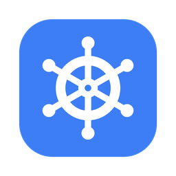

# Staff Bridge System

!!! warning "開発中のため、まだ販売していません"
    Staff Bridge System は現在開発中です。このドキュメントは仕様が固まる前に先行して公開しているもので、**記載している内容・画面・機能は変更される可能性があります**。発売日は未定です。

VRChat World

{ .product-icon }

VRChat ワールド用のイベント運営支援ギミック一式です。テレポートメニュー・インカム（無線）・一斉メッセージ・進行タイマーなどを、スタッフの手元メニューにまとめて導入できます。

- 商品ページ: 準備中
- 利用規約: [Staff Bridge System 利用規約（PDF）](https://drive.google.com/file/d/1Y1xBQFlrfcBY5iI4gYFHOwRgYQo4pm7a/view?usp=sharing)
- サンプルワールド: [Staff Bridge System Sample（VRChat）](https://vrchat.com/home/world/wrld_01cbbb48-44ce-4761-9baa-6f4ef87fbbfd/info)

## できること

スタッフになったプレイヤーの手元にメニューが表示され、次の操作ができます。

| 機能 | 内容 |
|---|---|
| テレポート | 登録地点および在室スタッフへの移動。お気に入り登録つき |
| インカム（無線） | 同じチャンネルのメンバーだけに聞こえる音声通話 |
| メガホン | 押している間だけ、来場者を含む全員に距離無視で声を届ける |
| 一斉メッセージ | 全スタッフ／選択したスタッフへの定型文送信 |
| タイマー・ログ | 全員に見える共有タイマー、自分だけのタイマーとストップウォッチ、入退室ログ |
| ノート | 進行台本の閲覧と、自分だけの走り書きメモ |
| スイッチ | 手元からワールド内のギミックへイベントを送る |
| 通知ログ | 受信・時間切れ・出入りを、視界の隅の1本のログにまとめて流す |
| スタッフ管理 | 当日スタッフの追加と削除（常設スタッフのみ） |
| 個人設定 | 音量・UI サイズ・発話方式・通知ログの位置を各自で調整（再入場後も保持） |

タブは並べ替えられ、使わないものは非表示にできます。

あわせて、シーン側に次のものを設置できます。

| 機能 | 内容 |
|---|---|
| 防音エリア | 中の会話が外に届かなくなる部屋。中に居てもインカムは使える |
| スタッフ限定オブジェクト | スタッフだけが見える／通れる／押せるオブジェクト |
| 在室スタッフ一覧ボード | いま入室しているスタッフ名の掲示 |
| 頭上マーカー | スタッフの頭上に表示される目印 |

イベントごとの作り込みは、Unity 上の専用ウィンドウから行えます。Inspector を直接触らずに済むよう、次の編集を支援します。

| 支援機能 | 内容 |
|---|---|
| メニュー構成 | 手元メニューのタブの並べ替えと ON / OFF。設定を引き継いだまま作り直せる |
| テレポート先の登録・編集 | 地点の追加・並べ替え・名前付け。生成済みのメニューにも後から反映できる |
| 定型メッセージの編集 | 一斉メッセージのプリセットをカテゴリごとに編集 |
| メニューの見た目 | 配色テーマ11種＋カスタム（役割色12色を個別編集）。生成済みのメニューにも適用できる |
| フォントの差し替え | 任意の TMP フォントを指定（未指定なら日本語フォントが既定で使われる） |
| スタッフ名簿の書き出し／読み込み | 名簿を `.asset` として保存し、別のワールドで使い回せる |
| インカムの一時停止 | 他の音声ギミックを使う回だけ、配置を崩さず本製品側を止められる |
| 診断・修復 | 設定の不備を検出してまとめて自動修復。聴こえ方マトリクス検査つき |

## 必要環境

| 項目 | 内容 |
|---|---|
| Unity | 2022.3.22f1 |
| VRChat SDK | Worlds SDK 3.10.x 以降 |
| 日本語フォント | [tmp-fallback-fonts-jp](https://github.com/Narazaka/tmp-fallback-fonts-jp)（**必須**） |
| FukuroUdon | [FukuroUdon](https://github.com/mimyquality/FukuroUdon)（**必須**・動作確認済み 3.18.0） |
| プラットフォーム | PC 専用（Quest 実機での動作確認は行っていません） |

前提パッケージ2つは VCC / ALCOM から導入できます。詳しくは [導入](install.md) を参照してください。

!!! tip "当日のスタッフへ渡すページ"
    [スタッフの方へ](for-staff.md) は、ワールド内での操作だけを説明したページです。Unity の用語は出てきません。当日のスタッフにはこの URL を渡してください。

## ドキュメントの読み進めかた

1. [導入](install.md) — 前提パッケージの用意からセットアップまで
2. [基本の使い方](usage.md) — ワールド内での操作
3. [やりたいことから探す](howto.md) — 目的別に、触る場所を引く
4. [運用ガイド](operation.md) — イベント当日の使い方と設計の考え方
5. [設定リファレンス](reference.md) — Inspector の各項目
6. [見た目のカスタマイズ](customize.md) — テーマ・フォント
7. [トラブルシューティング](troubleshoot.md) — 症状別の対処
8. [よくある質問](faq.md)

## スタッフの付与について

スタッフの付与方法は「表示名ホワイトリスト」「スタッフ切替スイッチ」「メニューのスタッフ管理タブ」の3通りです。スイッチは触れた本人がスタッフ ON / OFF できるため、設置場所にはご注意ください。詳しくは [運用ガイド](operation.md#staff-detection) を参照してください。
