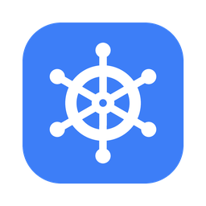

# Staff Bridge System

VRChat World

{ .product-icon }

VRChat ワールド用のイベント運営支援ギミック一式です。テレポート・インカム・一斉メッセージ・進行タイマーなどの機能を、スタッフ専用メニュー「SBSメニュー」にまとめています。

- 商品ページ: [BOOTH](https://maguro-vrc.booth.pm/items/8682451)
- 利用規約: [Staff Bridge System 利用規約（PDF）](https://drive.google.com/file/d/1Y1xBQFlrfcBY5iI4gYFHOwRgYQo4pm7a/view?usp=sharing)
- サンプルワールド: [Staff Bridge System Sample（VRChat）](https://vrchat.com/home/world/wrld_01cbbb48-44ce-4761-9baa-6f4ef87fbbfd/info)

!!! info "このドキュメントについて"
    利用規約は [利用規約](../terms.md) にまとめています。価格などの販売条件は BOOTH の商品ページをご確認ください。

## できること

スタッフになったプレイヤーの前に専用のSBSメニューが表示されます。

- 移動と連絡 — テレポート（登録地点・在室スタッフ）／インカム／メガホン／一斉メッセージ
- 進行 — 共有タイマーと自分用タイマー／ノート（共有メモと自分用メモ）／通知ログ／入退室ログ
- 運営 — 当日スタッフの追加と削除／手元からワールド内のギミックへイベントを送るスイッチ
- 各自の調整 — 音量・UI サイズ・発話方式・通知ログの位置（再入場後も保持）

タブは並べ替えられ、使わないものは非表示にできます。

シーン側には、スタッフ限定オブジェクト（スタッフだけが見える／通れる／押せる）、在室スタッフ一覧ボード、頭上マーカーを設置できます。

イベントごとの作り込みは Unity 上の専用ウィンドウから行います。メニュー構成・テレポート先・定型文・配色テーマ・スタッフ名簿を Inspector を直接触らずに編集でき、設定の不備は診断・修復でまとめて直せます。

各機能の詳細、設定ページへの入口、できないことは [機能一覧](features.md) にまとめてあります。

## 必要環境

| 項目 | 内容 |
|---|---|
| Unity | 2022.3.22f1 |
| VRChat SDK | Worlds SDK 3.10.x 以降 |
| FukuroUdon | [FukuroUdon](https://github.com/mimyquality/FukuroUdon)（**必須**・動作確認済み 3.19.5） |
| プラットフォーム | PC 専用（Quest 実機での動作確認は行っていません） |

FukuroUdon は VCC / ALCOM から導入できます。詳しくは [導入](install.md) を参照してください。

!!! tip "当日スタッフへ渡すページ"
    [スタッフの操作ガイド](usage.md) は、ワールド内での操作だけを説明したページです。Unity の用語は出てきません。当日スタッフにはこの URL を渡してください。

## 購入前に知っておいてほしいこと { #before-you-buy }

イベント当日に困らないよう、仕様上の制約や前提条件をまとめます。

  

    

      排他仕様
    

    <h4>他の音声ギミックと併用不可</h4>
    
防音室・個室・ボイスゾーンなど、プレイヤーの発話距離や音量を制御する他ギミックとは同時に使用できません（インカムか他ギミックのどちらか一方を選択）。

  

  

    

      動作規模
    

    <h4>確認済み規模は40人</h4>
    
40人規模のイベントでの運用実績があります。それを超える大規模インスタンスでの動作は未確認です。

  

  

    

      環境
    

    <h4>PC専用 / 前提パッケージ</h4>
    
Quest実機での動作確認は行っていません。また前提パッケージとして FukuroUdon の導入が必要です。

  

  

    

      上限・仕様
    

    <h4>判定ギミックは最大128個</h4>
    
スタッフ判定を使うギミックは1ワールド合計128個までです。スイッチは「1回のイベント発火」を担います。

  

!!! warning "本番前に実機で確認してください"
    ワールドの構成や同時に動く他のギミックによって、想定どおりに動作しないことがあります。本番と同じワールドで一通りの機能を動かして確認してください（[本番前の確認](operation.md#pre-event-check)）。イベント当日の不具合や、それによって進行に生じた損害について責任を負えません。

## ドキュメントの読み進めかた

あなたの役割や目的に合わせてガイドをご案内します。

  <a href="install.md" class="guide-nav-card">
    
🚀

    
ワールド制作者 →

    
前提パッケージの導入からセットアップ、Unity上でのカスタマイズ手順を確認できます。

  </a>

  <a href="usage.md" class="guide-nav-card">
    
🎪

    
当日スタッフ →

    
ワールド内でのメニュー操作・インカム・タイマーの使い方をUnity用語なしで説明しています。

  </a>

  <a href="for-developers.md" class="guide-nav-card">
    
⚙️

    
ギミック開発者 →

    
自作UdonスクリプトとSBSのスイッチやスタッフ判定を連携させる方法を解説しています。

  </a>

  <a href="faq.md" class="guide-nav-card">
    
📋

    
購入前・ライセンス →

    
個人・チームライセンスの数えかたや、よくある質問を視覚的にまとめています。

  </a>

## スタッフの付与について

スタッフの付与方法は「表示名ホワイトリスト」「スタッフ切替スイッチ」「メニューのスタッフ管理タブ」の3通りです。スイッチは触れた本人がスタッフ ON / OFF できるため、設置場所にはご注意ください。詳しくは [運用ガイド](operation.md#staff-detection) を参照してください。
