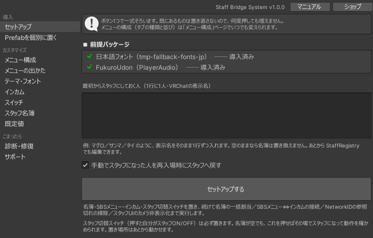
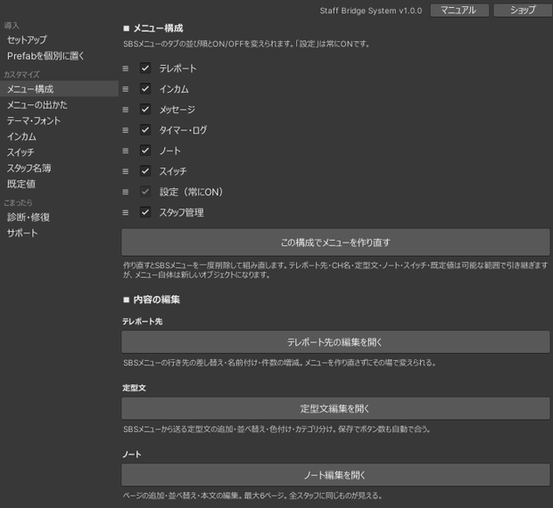

# 導入

## 1. 前提パッケージを導入する

VCC / ALCOM のプロジェクト設定から **FukuroUdon** を追加してください。

| パッケージ | 用途 | 配布元 |
|---|---|---|
| `com.mimylab.fukuroudon` | インカムの音声基盤（PlayerAudio） | [mimyquality/FukuroUdon](https://github.com/mimyquality/FukuroUdon) |

メニューの日本語表示に使うフォント `net.narazaka.vrchat.tmp-fallback-fonts-jp` は、FukuroUdon の依存パッケージとして一緒に導入されます。個別に追加する必要はありません。

!!! warning "インカムを使わない場合も必要です"
    同梱の Prefab が両パッケージのアセットを参照しています。日本語フォントが無いとメニューの文字が表示されず、FukuroUdon が無いとインカムが生成されません。

!!! info "FukuroUdon のバージョンについて"
    インカムは FukuroUdon の PlayerAudio Master（`PlayerAudioSupervisor` 等）の上に構築されており、内部実装を参照しています。**動作確認済みバージョンは 3.19.5** です。導入後はバージョンを固定し、更新する場合は先に診断と実機確認を行ってください。

### TMP Essentials をインポートする { #tmp-essentials }

日本語フォントを機能させるには、TextMesh Pro の **TMP Essentials** が必要です。TextMesh Pro を一度も使っていないプロジェクトには入っていません。

メニューバーから **Window ＞ TextMeshPro ＞ Import TMP Essential Resources** を実行してください（**Edit ＞ Project Settings ＞ TextMesh Pro** の画面からも実行できます）。`Assets/TextMesh Pro/` が作られれば完了です。すでに TextMesh Pro を使っているプロジェクトなら、この手順は不要です。

!!! warning "入れ忘れると、診断が OK でも文字が出ません"
    TMP Essentials が無いと TMP の設定ファイルそのものが作られないため、日本語フォールバックの設定が入りません。セットアップウィンドウの診断はパッケージの導入有無だけを見ているので、この状態でも「日本語フォント: 導入済み」と表示されます。文字が出ないときは、まずここを確認してください。

### 前提パッケージのライセンスについて

本製品は動作に FukuroUdon（MIT License）と TextMesh Pro VRC Fallback Font JP（SIL Open Font License）を利用します。いずれも本製品には同梱しておらず、各配布ページから各自で導入していただく形です。

- FukuroUdon: <https://github.com/mimyquality/FukuroUdon>
- TMP VRC Fallback Font JP: <https://github.com/Narazaka/tmp-fallback-fonts-jp>

## 2. unitypackage をインポートする

ワールドプロジェクトにインポートすると `Assets/MGR/Udon/StaffBridgeSystem/` に展開されます。

!!! note "フォルダの中身の構成は変えないでください"
    `Prefabs` / `Audio` / `Samples` などのサブフォルダ構成は維持してください。中のファイルを別の場所へ移すと参照できなくなります。

## 3. セットアップウィンドウを開く

メニューバーから **Tools ＞ MGR ＞ Staff Bridge System ＞ セットアップ** を選びます。

ウィンドウは左のサイドバーでページを切り替えます。

| グループ | ページ | 用途 |
|---|---|---|
| 導入 | セットアップ | 一式を配置する |
| 導入 | Prefab を個別に置く | 部品を1つずつ足す |
| カスタマイズ | メニュー構成 | 手元メニューのタブの並べ替え・ON / OFF、テレポート先・定型メッセージ・ノートの編集 |
| カスタマイズ | メニューの出かた | 開く操作、出る位置と大きさ、閉じかた、最初に開くタブ |
| カスタマイズ | テーマ・フォント | 配色とフォント |
| カスタマイズ | インカム | チャンネル数・チャンネル名、インカムの届き方と発話、一時停止 |
| カスタマイズ | スイッチ | 手元から送るイベントの行編集（ラベル・発火先・イベント名） |
| カスタマイズ | スタッフ名簿 | 常設スタッフの登録、`.asset` の書き出し／読み込み |
| カスタマイズ | 既定値 | メガホン・インカム・通知音・通知ログ・タイマーなどの初期値 |
| こまったら | 診断・修復 | 設定の過不足を検出し、修復する |
| こまったら | サポート | 問い合わせ用の状態レポート |

セットアップページの先頭に前提パッケージの状態が表示されます。未導入のものには警告アイコンと「導入ページを開く」ボタンが出ます。

## 4. 「セットアップする」を押す

ボタン1つで次がまとめて実行されます。

**配置されるもの**

- スタッフ名簿（StaffRegistry）
- 手元メニュー（テレポート／一斉メッセージ／インカム）
- インカムの音声基盤
- スタッフ切替スイッチ
- スタッフ一括解除スイッチ（切替スイッチと対で置かれます。誤って付いた人を戻す手段が無いと詰むためです）

**続けて実行される処理**

- 各ギミックへの名簿の一括割り当て
- 手元メニュー ⇔ インカムの接続
- NetworkID の参照切れの掃除
- スタッフUIをカメラに映さないためのレイヤー設定

!!! tip "何度押しても増えません"
    すでにあるものは置き直しません。設定を変えて押し直すこともできます。

### 配置内容を変えたい場合

同じページのボタンの下に、次の2つのチェックがあります（どちらも既定 ON）。

| 項目 | 内容 |
|---|---|
| 手動でスタッフになった人を再入場時にスタッフへ戻す | 当日スタッフの付与を保存し、次のインスタンスでも復帰させる |
| スタッフ切替スイッチ | 押すと自分がスタッフ ON / OFF になるスイッチを置く |

一覧ボード・専用スイッチ・ゲートはここに出てきません。置き場所を選ぶものなので、「Prefab を個別に置く」ページ（後述）で狙った場所に置くほうが早く済むためです。

同じ画面の「最初からスタッフにしておく人」に VRChat の表示名を1行に1人ずつ入力すると、その人はジョイン時に自動でスタッフになります。空のままなら名簿は書き換えません。あとから「スタッフ名簿」ページや StaffRegistry でも編集できます。

### 手元メニューのタブを決める { #menu-config }

セットアップでは全部のタブが入ったメニューが置かれます。使わないタブを外したい、並び順を変えたいときは、**カスタマイズ ＞ メニュー構成**ページで並べ替え・ON / OFF を指定して「この構成でメニューを作り直す」を押してください。テレポート先・CH名・定型文・ノートの内容・スイッチの設定は引き継がれます。

## 5. 動作を確認してアップロードする

アップロード前に、次を確認してください。

- StaffRegistry の **「ログ出力する」が OFF** であること
- 「診断・修復」ページで指摘が出ていないこと

「ログ出力する」が ON のままの場合、アップロード前チェックが警告ダイアログを出します（公開後もスタッフの表示名が Console に出続けるため）。警告のみで、アップロードはそのまま続行されます。

---

## 既存のワールドへの後付け

上記の手順そのままで後付けできます。すでに配置済みのオブジェクトは置き直されません。

配置後に参照が切れた場合（オブジェクトを移動した、Prefab を後から置いた等）は、「診断・修復」ページで検出・修復できます。

## 部品を単品で足す { #single-prefab }

「Prefab を個別に置く」ページのボタンから、いくつでも追加できます。置くと同時に名簿へ接続されるため、あとから診断を実行する必要はありません。

| ボタン | 内容 |
|---|---|
| スタッフ切替スイッチ | 押すと自分がスタッフ ON/OFF になるスイッチ |
| スタッフ専用スイッチ | スタッフだけが操作できるスイッチ（非スタッフが押すと拒否メッセージが出る） |
| スタッフゲート | スタッフだけ通れる壁 |
| 頭上マーカー | スタッフの頭上に出す目印。置き場所は問いません（実行中は自動で頭上へ移動します） |
| 在室スタッフ一覧ボード | 入室中のスタッフ名を表示するボード |

## 既存オブジェクトをスタッフ限定にする { #staff-only-existing }

ヒエラルキーでオブジェクトを選択し、右クリック ＞ **GameObject ＞ MGR ＞ Staff Bridge System** から選びます。

| メニュー | 動作 |
|---|---|
| スタッフだけ見えるようにする | 自分と配下の見た目・当たり判定を切り替える |
| スタッフ以外だけ見える（スタッフには隠す） | 上記の逆。スタッフのときだけ隠す |
| スタッフだけ押せるボタンにする | 既存のインタラクトをスタッフ限定にする |
| スタッフだけ通れる壁（ゲート）にする | 非スタッフだけを通さない壁にする |

同じ項目は **Tools ＞ MGR ＞ Staff Bridge System ＞ 選択オブジェクトに追加** からも実行できます。

「スタッフだけ見えるようにする」は対象自身の Renderer / Collider / Canvas を切り替えるため、音や配下ギミックの動作は止まりません。音ごと完全に消したい場合は `StaffOnlyVisible`（一括マネージャ）を手動で配置してください。詳しい違いは [設定リファレンス](reference.md#staff-only-objects) を参照してください。
