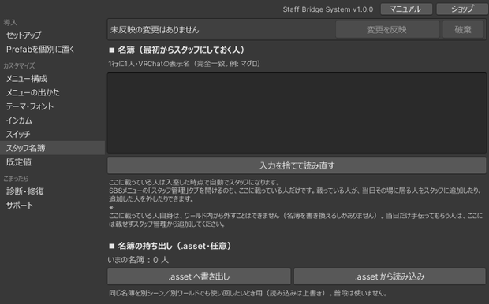
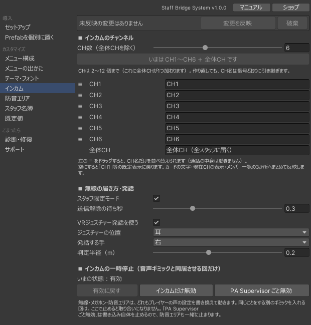
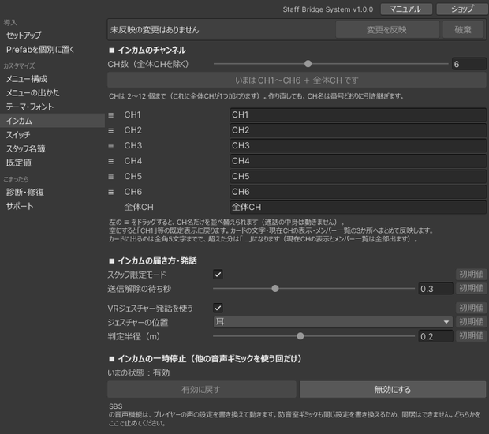

# 運用ガイド

イベントで実際に使うときの設計の考え方をまとめます。

## スタッフの付与方法を決める { #staff-detection }

「誰がスタッフか」は StaffRegistry が同期管理します。付与方法は3通りあり、併用もできます。

スタッフは2種類に分かれます。この2つはマニュアル全体で次の意味で使います。

| 呼び方 | どういう人か | できること |
|---|---|---|
| 常設スタッフ | 名簿（初期スタッフ名一覧）に表示名を登録した人 | 参加すると自動でスタッフON。ほかの人の追加・削除ができる。ワールド内からは外せない |
| 当日スタッフ | ワールド内でスタッフになった人 | メニューは常設スタッフと同じ。ほかの人の追加・削除はできない |

### 1. 表示名ホワイトリスト（常設スタッフ）

StaffRegistry の「初期スタッフ名一覧」に VRChat の表示名を登録すると、その人はジョイン時に自動でスタッフになります。当日の操作が不要なので、メンバーが事前に確定しているイベントに向いています。

判定は表示名の**完全一致**です。名簿の作り方は次の節を参照してください。

### 2. スタッフ切替スイッチ

スイッチをインタラクトすると、押した本人が自分でスタッフ ON / OFF できます。当日に急遽スタッフを増やす場合や、名簿から漏れた人への対応に使えます。

**スイッチに触れれば誰でも自分をスタッフにできます。** 一般公開ワールドでは、スタッフ控室などスタッフ以外が入れない場所に置くか、設置しないでください。

スイッチで当日スタッフは「再入場でスタッフ自動復帰」（既定 ON）によって保存され、**次のインスタンスでも自動でスタッフに戻ります**。意図しない人が付いてしまった場合は、次のスタッフ一括解除スイッチを使ってください。

### 3. メニューのスタッフ管理タブ

常設スタッフは、メニューの[スタッフ管理タブ](usage.md#staff-manage)から在室者を当日スタッフにできます。当日スタッフを個別に外すのも同じ場所です。

スイッチと違って本人以外が操作するため、スタッフ以外が自分でスタッフになることはありません。当日の増員を運営側の判断だけで行いたい場合は、スイッチを置かずにこの方法へ寄せるのが安全です。

常設スタッフはこのタブの一覧に出ません（剥奪の対象外です）。

### 4. スタッフ一括解除スイッチ

2回触れると、**当日スタッフを全員ぶん解除**します（1回目で確認待ち、時間内に2回目で確定）。誤って付いた人の後始末や、イベント終了後に付与を残さないための片付けに使います。

- 押せるのは**常設スタッフで、かつ現在スタッフ ON の人**だけです（スタッフ管理タブと同じ条件）。当日スタッフには押せないので、控室に置いても後始末の手段を奪われることはありません。
- **常設スタッフは解除されません。** 名簿による付与はワールドに焼き込まれた設定なので、当日スタッフだけが対象です。
- 保存された付与も消えるため、解除された人は次のインスタンスでもスタッフに戻りません。

!!! warning "その場に居ない人は解除できません"
    解除は、各自の端末が自分の保存データを書き換えることで成立します。そのため**インスタンスに居ない人には届きません。** 退室済みの人の付与を消すには、その人が入り直したときにもう一度スイッチを押してください。

### 使い分けの目安

- 事前にメンバーが決まっている → ホワイトリストを主に使う
- 当日の増減がある → 控室にスイッチを置いて併用する、または管理タブから付与する
- 誰でも入れる常設ワールド → スイッチは置かず、ホワイトリスト＋管理タブにする

## 名簿を準備する

名簿は「スタッフ名簿」ページから編集できます。1行に1人、VRChat の表示名を入れてください。

```
マグロ
サンマ
タイ
```



- 表示名は**完全一致**で判定されます。前後の空白や表記ゆれで一致しないことが最も多いトラブルです。本人にプロフィールからコピーしてもらうのが確実です。
- 当日、スタッフに表示名を変更しないよう事前に周知してください。
- 名簿は同じページから `.asset` として書き出し／読み込みできます。同じメンバーで別のワールドを運営する場合に使い回せます（読み込みは上書きです）。
- 当日だけ手伝ってもらう人は名簿には載せず、[スタッフ管理タブ](usage.md#staff-manage)から追加してください。名簿に載せた人は、ワールド内からは外せません（外すには名簿を書き換えてアップロードし直す必要があります）。
- 名簿から漏れた人は、控室のスタッフ切替スイッチでその場で対応できます。

## 途中入室したときの挙動 { #late-join }

イベント中の出入りで破綻しないよう、次のように動きます。

| 対象 | 途中から入室した場合 |
|---|---|
| スタッフ判定 | 名簿に載っていれば入室時に自動で付与されます。名簿は誰かが入室するたびに配り直されるため、端末間で表示が食い違っても次の入退室で揃います |
| 当日スタッフ | 「再入場でスタッフ自動復帰」（既定 ON）なら、入り直しても自動でスタッフに戻ります |
| 一斉メッセージ | **過去のメッセージは表示されません。** 送信からしばらく経ったものは、あとから入った人の画面には出ません |
| インカム | チャンネルの参加状態は自動で再送され、少し遅れて揃います |
| テレポートのお気に入り | 退室するとリセットされます |
| 共有タイマー | 実行中なら、残り時間がそのまま表示されます |
| スイッチの最終発火表示 | 同期されているため、あとから入った人にも同じ内容が見えます |
| 入退室ログ | 各自の端末の記録です。**自分が入室する前の出入りは残りません** |
| ノートのメモ欄 | 自分だけの走り書きです。次に来たときも残ります |

!!! warning "一斉メッセージは掲示板ではありません"
    「いま流れている連絡」として設計されています。遅れて来たスタッフにも伝える必要がある内容は、インカムで口頭で伝えるか、もう一度送ってください。

## インカムのチャンネル

チャンネルは既定で CH1〜CH6 と全体の7つで、それぞれ独立した通話になります。CH は「インカム」ページのスライダーで **2〜12個** の範囲に変えられます（これに全体CHが1つ加わります）。数を選んでボタンを押すと、その数へ一度に作り直します。

チャンネル名は番号どおりに引き継がれます（CH2 の名前は作り直しても CH2 に残ります）。減らした場合、消えたチャンネルの名前だけが失われます。全体CHの名前は末尾どうしで引き継がれます。

SBSメニューのチャンネルカードは、1枚の高さを保ったまま縦に並びます。**既定の6チャンネルまでは1画面に収まり**、それを超えるぶんは右端の ▲▼ ボタンで送ります（全体CHは下に固定で残ります）。

表示名は「インカム」ページの **インカムのチャンネル** から変えられます（「受付」「ステージ」など）。左の ≡ をドラッグすると名前だけを並べ替えられます（通話の中身は動きません）。カードの文字・現在のチャンネルの表示・メンバー一覧の3か所へまとめて反映されます。



全体CHが届くのは**全スタッフ**です。どのチャンネルにも入っていないスタッフにも届きます。スタッフ以外にも届くのはメガホンだけです。

同じチャンネルでは複数人が同時に話せます（全二重）。送信を1人に制限する仕組みは無いため、混線を防ぐのは運用ルールの役目です。

「診断・修復」ページの**インカム聴こえ方マトリクス検査**を使うと、設定した構成で「誰の声が誰に聞こえるか」をエディタ上で確認できます。本番前の確認に使ってください。

## 定型文を設計する { #broadcast-presets }

「メニュー構成」ページの **定型文編集** から、定型文の追加・並べ替え・カテゴリ分けができます。保存するとボタン数も自動的に合わせられます。

- 最初から15件（接客／CH誘導／移動／指示）が入っています。イベントに合わせて書き換えてください。
- カテゴリ名でタブが分かれるため、**当日よく使うものを1つのカテゴリにまとめる**と押しやすくなります。
- TMP のリッチテキストが使えるため、緊急度の高いものは色を変えると目立ちます。

## 本番前の確認 { #pre-event-check }

!!! warning "本番前に、実際のワールドで動作を確認してください"
    本製品のもとになったプロトタイプは、40人規模のイベントで運用しました。それを超える規模や、ワールドの構成・同時に動く他のギミックによっては、想定どおりに動作しないことがあります。

    イベント当日に不具合が生じた場合や、それによって進行に生じた損害について、こちらでは責任を負えません。

    はじめて本番で使う回は、動かなかったときにスタッフ間で連絡を取る手段を別に用意しておいてください。

本番と同じワールド・同じ設定で、**一通りの機能を実際に動かして確認してください。** スタッフの付与、インカムの通話、テレポート、一斉メッセージ、スイッチの発火まで、実際に人が触る順に通すのが確実です。

確認しておきたい点が2つあります。

- **インカムの声がスタッフ以外に聞こえないこと。** 別アカウントでスタッフ以外として入り、耳で確かめてください。設定上の聞こえ方は「診断・修復」ページの**インカム聴こえ方マトリクス検査**でも事前に見られます。
- **スイッチの発火先が実際に動くこと。** イベント名の打ち間違いはコンパイルエラーにならず、押しても無音で失敗します。

そのほか、「診断・修復」ページで指摘が出ていないこと、定型文とノートが今回のイベント用の内容になっていることを確認してください。


## 設置上の注意

- **インカム本体と一斉メッセージ本体は、常に Active な GameObject の下に置く必要があります。** メニューを閉じても耳元での発話やメッセージ受信が機能するようにするためです。誤配置は診断が検出します。
- **インカムは1シーンに1つだけ**にしてください。音声基盤（PA Supervisor）が2つあるとプレイヤータグを取り合います。診断で複数検出された場合は統合してください。
- **プレイヤーの声を操作する他のギミックとは干渉する可能性があります。** 個室・ボイスゾーン・拡声・声の距離やゲイン変更といったギミックは、インカムと同じ仕組み（プレイヤーの音声設定）を奪い合うため、どちらかが意図どおりに動かなくなります。拡声だけなら本製品側の[メガホン](usage.md#megaphone)でまかなえます。他のギミックを使う回は、「インカム」ページの**インカムの一時停止**から本製品側を止めれば取り合いになりません（下記）。
- スタッフ UI がワールド内のカメラやミラーに映らないよう、セットアップ時にレイヤー設定が行われます。VRC_MirrorReflection の Reflect Layers は診断で個別に確認・修正できます。

## 他の音声ギミックとは同居できない { #incom-power }

**防音室・個室・ボイスゾーン・音量調整・拡声など、プレイヤーの声を操作するギミックとインカムは、同時には使えません。** ワールドごとに、どちらか片方を選ぶことになります。

インカムはプレイヤーの声の届く距離（`VRCPlayerApi.SetVoiceDistanceFar` など）を書き換えて動きます。同じ設定を操作するギミックが同居すると互いの書き込みが打ち消し合い、どちらも意図どおりに動かなくなります。相手のギミックの範囲内に限った話ではなく、ワールドのどこに居ても起こります。置く順番や場所を変えても解決しません。

シーンに該当するギミックがあるかは、「診断・修復」ページで検出できます。

### 他のギミックを選ぶ回は、本製品側を止める

「インカム」ページの **インカムの一時停止** から、配置を崩さずに止められます。次のイベントで戻すのも1クリックです。



| 状態 | 内容 |
|---|---|
| 有効 | 通常。インカムもメガホンも動く |
| 無効 | インカム・メガホン・ピックアップマイクを止め、SBSメニューのインカムタブを隠し、PA Supervisor の書き込みも止める |

インカム・メガホンを止めるだけでは足りないため、PA Supervisor の書き込みまで同時に止めます。残しておくと、誰かが入室するたびに声の設定が既定値へ書き戻され、相手のギミックを打ち消してしまうためです。

テレポート・一斉メッセージ・スタッフ限定オブジェクト・タイマー・ノートは音声を使わないため、どの状態でもそのまま使えます。

### 一時停止と「最初から置かない」の使い分け

インカムを使わないことが導入の時点で決まっているなら、一時停止ではなく、そもそも置かないほうが簡単です。

| 場面 | やること |
|---|---|
| 導入時に「このワールドではインカムを使わない」と決まっている | 「メニュー構成」ページでインカムを OFF にしてから作り直す。音声基盤ごと置かれません |
| すでに置いたあとで、他の音声ギミックを入れることになった | このページの **インカムの一時停止** で無効にする |

置いたあとで「メニュー構成」から OFF にしても、すでにシーンにある音声基盤（`StaffBridgeSystem_IncomBackend`）は残ります。残っていると PA Supervisor も動いたままなので、あとから外す場合は一時停止を使ってください。

