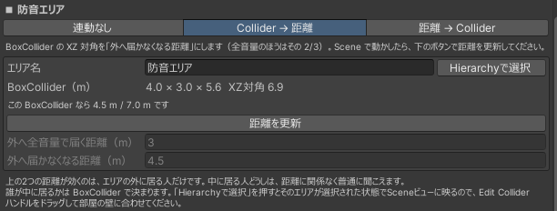

# 運用ガイド

イベントで実際に使うときの設計の考え方をまとめます。

## スタッフの付与方法を決める { #staff-detection }

「誰がスタッフか」は StaffRegistry が同期管理します。付与方法は3通りあり、併用もできます。

スタッフは2種類に分かれます。この2つはマニュアル全体で次の意味で使います。

| 呼び方 | どういう人か | できること |
|---|---|---|
| 常設スタッフ | 名簿（初期スタッフ名一覧）に表示名を登録した人 | 参加すると自動でスタッフON。ほかの人の追加・削除ができる。ワールド内からは外せない |
| 当日スタッフ | ワールド内でスタッフになった人 | メニューは常設スタッフと同じ。ほかの人の追加・削除はできない |

### 1. 表示名ホワイトリスト（常設スタッフ）

StaffRegistry の「初期スタッフ名一覧」に VRChat の表示名を登録すると、その人はジョイン時に自動でスタッフになります。当日の操作が不要なので、メンバーが事前に確定しているイベントに向いています。

判定は表示名の**完全一致**です。名簿の作り方は次の節を参照してください。

### 2. スタッフ切替スイッチ

スイッチをインタラクトすると、押した本人が自分でスタッフ ON / OFF できます。当日に急遽スタッフを増やす場合や、名簿から漏れた人への対応に使えます。

**スイッチに触れれば誰でも自分をスタッフにできます。** 一般公開ワールドでは、スタッフ控室など来場者が入れない場所に置くか、設置しないでください。

スイッチで当日スタッフになった人は「再入場でスタッフ自動復帰」（既定 ON）によって保存され、**次のインスタンスでも自動でスタッフに戻ります**。意図しない人が付いてしまった場合は、次のスタッフ一括解除スイッチを使ってください。

### 3. メニューのスタッフ管理タブ

常設スタッフは、メニューの[スタッフ管理タブ](usage.md#staff-manage)から在室者を当日スタッフにできます。当日スタッフを個別に外すのも同じ場所です。

スイッチと違って本人以外が操作するため、来場者が自分でスタッフになることはありません。当日の増員を運営側の判断だけで行いたい場合は、スイッチを置かずにこの方法へ寄せるのが安全です。

常設スタッフはこのタブの一覧に出ません（剥奪の対象外です）。

### 4. スタッフ一括解除スイッチ

2回触れると、**当日スタッフを全員ぶん解除**します（1回目で確認待ち、時間内に2回目で確定）。誤って付いた人の後始末や、イベント終了後に付与を残さないための片付けに使います。

- 押せるのは**常設スタッフで、かつ現在スタッフ ON の人**だけです（スタッフ管理タブと同じ条件）。当日スタッフには押せないので、控室に置いても後始末の手段を奪われることはありません。
- **常設スタッフは解除されません。** 名簿による付与はワールドに焼き込まれた設定なので、当日スタッフだけが対象です。
- 保存された付与も消えるため、解除された人は次のインスタンスでもスタッフに戻りません。

!!! warning "その場に居ない人は解除できません"
    解除は、各自の端末が自分の保存データを書き換えることで成立します。そのため**インスタンスに居ない人には届きません。** 退室済みの人の付与を消すには、その人が入り直したときにもう一度スイッチを押してください。

### 使い分けの目安

- 事前にメンバーが決まっている → ホワイトリストを主に使う
- 当日の増減がある → 控室にスイッチを置いて併用する、または管理タブから付与する
- 誰でも入れる常設ワールド → スイッチは置かず、ホワイトリスト＋管理タブにする

## 名簿を準備する

名簿は「編集」タブから編集できます。1行に1人、VRChat の表示名を入れてください。

- 表示名は**完全一致**で判定されます。前後の空白や表記ゆれで一致しないことが最も多いトラブルです。本人にプロフィールからコピーしてもらうのが確実です。
- 当日、スタッフに表示名を変更しないよう事前に周知してください。
- 名簿は「編集」タブから `.asset` として書き出し／読み込みできます。同じメンバーで別のワールドを運営する場合に使い回せます（読み込みは上書きです）。
- 当日だけ手伝ってもらう人は名簿には載せず、[スタッフ管理タブ](usage.md#staff-manage)から追加してください。名簿に載せた人は、ワールド内からは外せません（外すには名簿を書き換えてアップロードし直す必要があります）。
- 名簿から漏れた人は、控室のスタッフ切替スイッチでその場で対応できます。

## 途中入室したときの挙動 { #late-join }

イベント中の出入りで破綻しないよう、次のように動きます。

| 対象 | 途中から入室した場合 |
|---|---|
| スタッフ判定 | 名簿に載っていれば入室時に自動で付与されます。名簿は誰かが入室するたびに配り直されるため、端末間で表示が食い違っても次の入退室で揃います |
| 当日スタッフ | 「再入場でスタッフ自動復帰」（既定 ON）なら、入り直しても自動でスタッフに戻ります |
| 一斉メッセージ | **過去のメッセージは表示されません。** 送信からしばらく経ったものは、あとから入った人の画面には出ません |
| インカム | チャンネルの参加状態は自動で再送され、少し遅れて揃います |
| テレポートのお気に入り | 退室するとリセットされます |

!!! warning "一斉メッセージは掲示板ではありません"
    「いま流れている連絡」として設計されています。遅れて来たスタッフにも伝える必要がある内容は、インカムで口頭で伝えるか、もう一度送ってください。

## インカムのチャンネル

チャンネルは既定で CH1〜CH6 と全体の7つで、それぞれ独立した通話になります。CH は「編集」タブのスライダーで **2〜12個** の範囲に変えられます（これに全体CHが1つ加わります）。数を選んでボタンを押すと、その数へ一度に作り直します。

CH名は番号どおりに引き継がれます（CH2 の名前は作り直しても CH2 に残ります）。減らした場合、消えたCHの名前だけが失われます。全体CHの名前は末尾どうしで引き継がれます。

手元メニューのCHカードは、1枚の高さを保ったまま縦にスクロールします。**既定の6CHまでは1画面に収まり**、それを超えるぶんはスクロールで送ります（全体CHは下に固定で残ります）。

表示名は「編集」タブの **インカムのチャンネル** から変えられます（「受付」「ステージ」など）。左の ≡ をドラッグすると名前だけを並べ替えられます（通話の中身は動きません）。カードの文字・現在CHの表示・メンバー一覧の3か所へまとめて反映されます。

全体CHが届くのは**全スタッフ**です（どのCHにも入っていないスタッフにも届きます）。来場者にも届くのはメガホンだけです。手元メニューでも「全体CH（全スタッフに届く）」と表示されます。

同じチャンネルでは複数人が同時に話せます（全二重）。送信を1人に制限する仕組みは無いため、混線を防ぐのは運用ルールの役目です。

「診断・修復」タブの**インカム聴こえ方マトリクス検査**を使うと、設定した構成で「誰の声が誰に聞こえるか」をエディタ上で確認できます。本番前の確認に使ってください。

## 防音エリアを置く { #sound-area }

「セットアップ」タブの **Prefab を1つずつ置く** ＞ **防音エリア** から置きます。置いたあとの手順は次の2つです。

1. Scene ビューで `BoxCollider` を部屋の大きさに合わせる
2. 「編集」タブの **防音エリア** で、名前と遮る距離を決める

「Hierarchyで選択」を押すとそのエリアが選択された状態で Scene ビューに映るので、BoxCollider の Edit Collider ハンドルをドラッグして部屋の壁に合わせてください。

| 項目 | 内容 |
|---|---|
| 外へ全音量で届く距離 | エリアの外に居る人には、この距離まで中の声がそのままの音量で届きます（既定 3m） |
| 外へ届かなくなる距離 | この距離を超えると、外に居る人にはまったく届きません（既定 4.5m） |

**この2つは、外に居る人への聞こえ方の設定です。**中に居る人どうしは声の設定を書き換えないので、VRChat の通常の声（既定の距離減衰）のままです。誰が中に居るかを決めるのは `BoxCollider` のほうで、役割が別なので、既定では片方を変えてももう片方は変わりません。

### BoxCollider と距離を連動させる

「編集」タブの防音エリアの見出し下で、どちらを基準にするか選べます。

| モード | 動き |
|---|---|
| 連動なし | 連動しません。`BoxCollider` も距離も、それぞれ自分で決めます |
| Collider → 距離 | Scene ビューで部屋に合わせた `BoxCollider` から距離を計算します。距離の欄は編集できなくなり、食い違っていると「距離を更新」ボタンが出ます |
| 距離 → Collider | 入れた「外へ届かなくなる距離」から `Size` の X と Z を書き換えます。Scene ビューで動かす必要がありません |

どちらのモードでも **`BoxCollider` の XZ 対角 ＝ 外へ届かなくなる距離** で対応させ、「外へ全音量で届く距離」はその 2/3（既定 3m / 4.5m と同じ比）になります。値は 0.5m 刻みに丸められます。

- 対角に使うのは XZ（幅と奥行き）だけです。**`Size` の Y と `Center` は変わりません。**
- 「距離 → Collider」で作られるのは正方形です。細長い部屋は、このモードで大きさの当たりを付けてから Scene ビューで整えるか、「Collider → 距離」を使ってください。
- ボタンで入るのは下書きです。タブ上部の **変更を反映** を押すまでシーンは変わりません。

距離を大きくするほど部屋の中では会話しやすくなりますが、外へ漏れる範囲も同じだけ広がります。**部屋同士は「外へ届かなくなる距離」より離して配置してください。**

エリアが2つ以上あるときは、一覧の上に **まとめて変える** 欄が出ます。ここに入れた距離は全エリアに入ります。部屋の大きさが違うエリアだけ、下の個別の欄で上書きしてください（個別に変えたエリアがあると、まとめて変える欄は「—」表示になります）。

エリアは1ワールドに16個まで置けます。

## 定型メッセージを設計する { #broadcast-presets }

「編集」タブの **プリセットメッセージ編集** から、定型文の追加・並べ替え・カテゴリ分けができます。保存するとボタン数も自動的に合わせられます。

- 最初から15件（接客／CH誘導／移動／指示）が入っています。イベントに合わせて書き換えてください。
- カテゴリ名でタブが分かれるため、**当日よく使うものを1つのカテゴリにまとめる**と押しやすくなります。
- TMP のリッチテキストが使えるため、緊急度の高いものは色を変えると目立ちます。

## 本番前の確認

!!! warning "本番前に、実際のワールドで動作を確認してください"
    本製品のもとになったプロトタイプは、30人規模のイベントで運用して安定して動作しました。それを超える規模や、ワールドの構成・同時に動く他のギミックによっては、想定どおりに動作しない可能性があります。

    セットアップが正しく完了しているか、各機能が動くかを、**本番前に必ず確認してください**。イベント当日に不具合が発生した場合や、それによってイベントの進行に生じた損害について、こちらでは責任を負えません。

最低限、次を確認してから本番に臨むことを勧めます。

- [ ] 「診断・修復」タブで指摘が出ていない
- [ ] StaffRegistry の「ログ出力する」が OFF
- [ ] スタッフ全員が名簿で自動 ON になる（一覧ボードで確認）
- [ ] 各チャンネルで通話テストが通る
- [ ] 無線の声が来場者側に聞こえないことを別アカウント等で確認
- [ ] テレポート地点を一巡して着地位置を確認
- [ ] 定型メッセージが今回のイベント用の内容になっている

## 設置上の注意

- **インカム本体と一斉メッセージ本体は、常に Active な GameObject の下に置く必要があります。** メニューを閉じても耳元での発話やメッセージ受信が機能するようにするためです。誤配置は診断が検出します。
- **インカムは1シーンに1つだけ**にしてください。音声基盤（PA Supervisor）が2つあるとプレイヤータグを取り合います。診断で複数検出された場合は統合してください。
- **プレイヤーの声を操作する他のギミックとは干渉する可能性があります。** 個室・ボイスゾーン・拡声・声の距離やゲイン変更といったギミックは、インカムと同じ仕組み（プレイヤーの音声設定）を奪い合うため、どちらかが意図どおりに動かなくなります。同種の用途は本製品側の[メガホン](usage.md#megaphone)と[防音エリア](usage.md#area-voice)でまかなえるようにしてあるので、そちらへ寄せることを勧めます。他のギミックを使う回は、「編集」タブの**インカムの一時停止**から本製品側を止めれば取り合いになりません（下記）。
- スタッフ UI がワールド内のカメラやミラーに映らないよう、セットアップ時にレイヤー設定が行われます。VRC_MirrorReflection の Reflect Layers は診断で個別に確認・修正できます。

## 他の音声ギミックと同居させる { #incom-power }

別の音声ギミックを使う回は、「編集」タブの **インカムの一時停止** から本製品側を止められます。配置を崩さずに切り替えられるので、次のイベントで戻すのも1クリックです。

| 状態 | 内容 |
|---|---|
| 有効 | 通常。無線・メガホン・防音エリアがすべて動く |
| インカムだけ無効 | 無線とメガホンを止める。防音エリアは動いたまま |
| PA Supervisor ごと無効 | 声の書き換えそのものを止めて、他のギミックへ明け渡す。防音エリアも止まる |

テレポート・一斉メッセージ・スタッフ限定オブジェクトは音声を使わないため、どの状態でもそのまま使えます。

併用する場合は、本番前に実機で「誰の声が誰に聞こえるか」を必ず確認してください。
