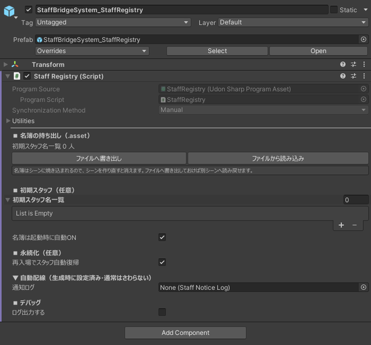
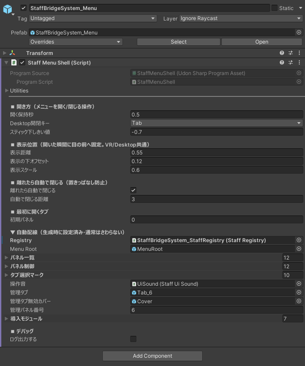
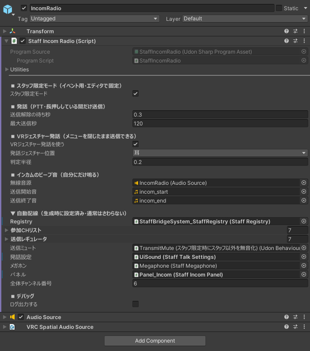

# 設定リファレンス

各コンポーネントの Inspector 項目です。「【自動】」と表示されている項目は生成時に自動で設定されるため、通常は触る必要がありません。

---

## StaffRegistry（スタッフ名簿）

「今誰がスタッフか」をインスタンス全体で同期管理する中核です。**1シーンに1つだけ**配置します。各ギミックはここに登録して、スタッフ状態の変化を受け取ります。

| 項目 | 型 | 既定 | 内容 |
|---|---|---|---|
| 初期スタッフ名一覧 | string[] | 空 | ジョイン時に自動でスタッフ ON にする表示名の一覧（完全一致） |
| 名簿は起動時に自動ON | bool | ON | 常設スタッフのジョイン時に自動でスタッフにする |
| 再入場でスタッフ自動復帰 | bool | ON | 手動で ON にした人が再入場したとき自動で復帰させる（VRChat Persistence を使用） |
| ログ出力する | bool | OFF | スタッフの追加・削除を Console に出す |

!!! warning "アップロード前に確認"
    「ログ出力する」が ON のままだと、公開後もスタッフの表示名が Console に出続けます。アップロード前チェックが警告を出しますが、アップロードは止まりません。OFF にしてからアップロードしてください。

ローカルでの動作確認は、スタッフ切替スイッチで自分をスタッフにして行ってください。

---

## StaffMenuShell（メニュー本体） { #menu-shell }

メニューの開閉・表示位置・スタッフ判定の門番を担当します。個々の機能はパネルとして分離されています。

下の「開閉操作」「表示」は、セットアップ窓の **カスタマイズ ＞ メニューの出かた** ページからも変えられます（通常はそちらが早いです）。

### 開閉操作

| 項目 | 型 | 既定 | 内容 |
|---|---|---|---|
| 開く保持秒 | float | 0.5 | 開閉に必要な長押し秒数（目安 0.3〜0.7） |
| Desktop開閉キー | enum | Tab | Desktop で開閉に使うキー（Tab / F1〜F4 / B / G / N）。VR では未使用 |
| スティック下しきい値 | float | -0.7 | VR で開閉判定する右スティック下倒し量（-1〜0） |

### 表示

| 項目 | 型 | 既定 | 内容 |
|---|---|---|---|
| 表示距離 | float | 0.55 | 開いた瞬間に頭前方へ出す距離（m。目安 0.5〜0.7） |
| 表示の下オフセット | float | 0.12 | 画面中央から下へずらす量（m） |
| 表示スケール | float | 0.6 | メニュー全体の大きさ倍率（1 で標準）。0.75 を超えると Desktop で下端が画面外に出やすい |
| 離れたら自動で閉じる | bool | ON | 開いた場所から離れると自動で閉じる |
| 自動で閉じる距離 | float | 3 | 自動クローズの距離（m）。0 以下で無効 |
| 初期パネル | int | 0 | **最初に開いたとき**に表示するパネル番号（0 = 1番目）。2回目以降は前回開いていたパネルが表示される |
| ログ出力する | bool | OFF | 開閉・パネル切替のログを Console に出す |

---

## StaffIncomRadio（インカム） { #incom }

チャンネルの参加・離脱と発話を担当します。同じチャンネルのメンバーの発話だけが、距離に関係なく聞こえます。

下の設定は、セットアップ窓の **カスタマイズ ＞ インカム** ページからも変えられます。

!!! warning "配置場所の制約"
    メニュー配下ではなく、**常に Active な GameObject** の下に置く必要があります。メニューを閉じた状態でも発話できるようにするためです。誤って配置した場合は、このコンポーネントの Inspector に注意書きが表示されます。

### 動作モード

| 項目 | 型 | 既定 | 内容 |
|---|---|---|---|
| スタッフ限定モード | bool | ON | 送信中の声を同チャンネルのメンバー以外に聞かせない。ワールドに焼き込まれ全員一律。**OFF にすると、インカムが届かない相手にも通常の声（距離減衰あり）として聞こえる** |
| 送信解除の待ち秒 | float | 0.3 | 発話終了から送信を切るまでの待ち時間（語尾切れ防止。目安 0.2〜0.4） |
| 最大送信秒 | float | 120 | 押しっぱなし防止の強制切断秒（目安 60〜120） |

### VR ジェスチャー発話

| 項目 | 型 | 既定 | 内容 |
|---|---|---|---|
| VRジェスチャー発話を使う | bool | ON | 右手を体の指定位置に近づけてトリガーを引くと発話する |
| 発話ジェスチャー位置 | enum | 耳 | 手を近づける位置（耳／肩／胸元）。メガホンも同じ位置を使う |
| 判定半径 | float | 0.20 | 手がその位置に来たと判定する半径（m。目安 0.15〜0.25） |

### 音

| 項目 | 型 | 内容 |
|---|---|---|
| 無線音源 | AudioSource | ビープを鳴らす AudioSource（2D・Play On Awake OFF 推奨） |
| 送信開始音 / 送信終了音 | AudioClip | 送信の開始・終了のビープ（任意） |

### 受信ビープ（StaffIncomReceiveBeep）

自分の受信チャンネルで誰かが話し始めた／全員が話し終えたときに、聞き手に小さな音を鳴らす補助コンポーネントです。

| 項目 | 既定 | 内容 |
|---|---|---|
| 受信開始音 / 受信終了音 | — | 鳴らす AudioClip |
| 監視間隔秒 | 0.25 | 発話状態を確認する間隔 |

チャンネルに参加していないときは、全体チャンネルの発話だけを拾います。

---

## StaffMegaphone（メガホン） { #megaphone }

拡声している間だけ、スタッフ以外を含む全員へ声を届けます。インカムのチャンネル機構の外を通るため、インカムとは競合しません。

| 項目 | 型 | 既定 | 内容 |
|---|---|---|---|
| 起動長押し秒 | float | 0.5 | ボタンを押し続けてから拡声が始まるまでの秒数（誤タップ防止） |
| 最大使用秒 | float | 180 | 連続使用がこの秒数を超えたら強制的に切る保険 |
| VRジェスチャーを使う | bool | ON | 左手をインカムと同じ位置へ近づけてトリガーを引くと拡声する。OFF にするとボタンと Desktop キーだけになる |

インカムとの相互排他、スタッフでなくなったときの即時停止、使用中のステータス表示は常に有効で、設定項目はありません。

ボタンの方式（長押し／トグル）と Desktop キーは各自が[設定タブ](usage.md#settings)で選びます。初期値は [StaffTalkSettings](#talk-settings) が持ちます。ジェスチャーの位置（耳／肩／胸元）と判定半径は[インカム](#incom)側の設定を共通で使い、手はインカム＝右・メガホン＝左で固定です。

---

## StaffBroadcast（一斉メッセージ） { #broadcast }

定型文をスタッフへ一斉送信します。受信側は[通知ログ](#notice-log)・通知音・受信ログで受け取ります。サーバー時刻を見て、レイトジョイン時に古いメッセージが再表示されるのを防いでいます。

!!! warning "配置場所の制約"
    StaffIncomRadio と同じく、**常に Active な GameObject** の下に置く必要があります。

### 内容

| 項目 | 型 | 既定 | 内容 |
|---|---|---|---|
| プリセット | string[] | 15件 | 送信できる定型文。TMP のリッチテキストが使える。専用の編集ウィンドウあり |
| プリセットカテゴリ | string[] | 接客／CH誘導／移動／指示 | 各定型文のタブ分けカテゴリ名（プリセットと同じ順序）。空欄は「その他」 |

### 受信

| 項目 | 型 | 既定 | 内容 |
|---|---|---|---|
| 表示秒 | float | 6 | 受信を「新着」とみなす有効時間（秒）。これより古いメッセージは入室時に出さない |
| 履歴件数 | int | 16 | メッセージタブの受信ログに残す件数 |

視界への表示そのものは [StaffNoticeLog](#notice-log) が担当します。表示位置や消えるまでの秒数はそちらの設定です。

### 自分宛の強調・音

| 項目 | 型 | 既定 | 内容 |
|---|---|---|---|
| 自分宛を強調する | bool | ON | 個別指定された自分宛メッセージを強調表示（全員宛には付かない） |
| 自分宛プレフィックス | string | `<color=#FFD24D>【あなた宛】</color> ` | 自分宛メッセージの先頭に付ける目印 |
| 通知音 | AudioSource | — | 受信時に鳴らす音（任意） |
| 送信音 | AudioSource | — | 送信した瞬間に自分にだけ鳴る確認音（任意） |

---

## StaffNoticeLog（通知ログ） { #notice-log }

メッセージの受信・タイマーの到達・入退室・スタッフ権限の変化・スイッチの発火を、視界の隅の1本のログに流します。スタッフにだけ見えます。

!!! warning "配置場所の制約"
    メニュー配下ではなく、**常に Active な GameObject** の下に置く必要があります。メニューを閉じていても通知が出るようにするためです。

| 項目 | 型 | 既定 | 内容 |
|---|---|---|---|
| 表示位置 | int | 0 | 出す位置の初期値（0 = 左下 / 2 = 表示しない。1 = 右下は廃止し、指定されていても左下へ丸める）。**各自が設定タブで上書きでき、その選択は PlayerData に保存されます** |
| 入退室を表示する | bool | ON | 入退室をログに流す。人の出入りが多いイベントでは OFF にできる |
| 表示秒 | float | 20 | 1件が消えるまでの秒数 |
| 自分宛表示秒 | float | 40 | 個別に自分宛だったメッセージが消えるまでの秒数（読み逃し防止のため長め） |
| メッセージ色 / タイマー色 / システム色 / 入退室色 | Color | テーマ色 | 行の左端に出す種別の帯の色（タイマーだけはテーマに警告色が無いため固定の黄系） |

同時に表示できるのは5件までで、溢れたぶんは古い行から消えます。行の本文は省略されず、欄の幅で折り返します。

色以外の項目は、セットアップ窓の **カスタマイズ ＞ 既定値** ページからも変えられます（共有タイマーの確認秒・入退室ログの保持行数も同じページです）。

---

## StaffOpsTimer（タイマー） { #timer }

共有タイマー・ローカルタイマー・ストップウォッチをまとめて持ちます。共有タイマーだけが同期し、残りは自分専用です。

| 項目 | 型 | 既定 | 内容 |
|---|---|---|---|
| 確認の有効秒 | float | 5 | 共有タイマーの開始／取消で、1回目から2回目までに確定できる秒数 |
| ログ出力する | bool | OFF | 共有タイマーの操作を Console に出す |

共有タイマーの操作ができるのはスタッフだけです。時間切れは[通知ログ](#notice-log)に「共有タイマー ◯分が経過しました」と流れます（ローカル側は「ローカルタイマー」と出るので、ほぼ同時に鳴っても見分けられます）。

---

## StaffJoinLog（入退室ログ） { #join-log }

入室・退室を記録します。記録は各自の端末で行われるため、自分が入室する前の出入りは含まれません。

| 項目 | 型 | 既定 | 内容 |
|---|---|---|---|
| 最大行数 | int | 100 | 保持する行数。超えたぶんは古い行から捨てる |
| 入室色 / 退室色 | Color | テーマの意味色 | 行の文字色（既定は入室＝緑・退室＝赤） |
| ログ出力する | bool | OFF | 動作ログを Console に出す |

タイマー・ログタブでは最新6行が見え、「ログを開く」から全画面の一覧ページを開けます。

---

## StaffCuePanel（ノート） { #cue }

共有メモを複数ページで表示します。進行台本やチェックリストの掲示に使います。すべてローカル動作で、同期はしません。

| 項目 | 型 | 既定 | 内容 |
|---|---|---|---|
| ページ名 | string[] | 開場前 / 本編 / 終了後 | ページ切替ボタンに出す名前。**ページ本文と同じ数・同じ順**にする |
| ページ本文 | string[] | 3件 | 各ページの本文。TMP のリッチテキストが使える。**1ページ256字まで**（タグ・改行も含む） |

通常は Inspector ではなく、セットアップ窓の **カスタマイズ ＞ メニュー構成 ＞ ノート編集を開く**（または `Tools ＞ MGR ＞ Staff Bridge System ＞ ノート編集`）から編集してください。ページの追加・並べ替え・本文の編集がまとめて行え、2つの配列の数が食い違う心配もありません。

ページは最大6枚・1ページの本文は256字までです（超えるとノート編集の「シーンへ適用」が止まります。Inspector 直編集のすり抜けは[診断・修復](troubleshoot.md)が知らせます）。右の入力欄は各自の走り書きメモで、同期せず、次に来たときも残ります（欄に見えている12行が上限）。

---

## StaffTrigger（スイッチ） { #trigger }

手元のボタンから、ワールド内の任意のギミックへイベントを1つ送ります。

| 項目 | 型 | 内容 |
|---|---|---|
| ラベル | string[] | ボタンに出す名前（例:「開場ゲートを開く」）。この数だけボタンが並ぶ |
| 発火先 | UdonBehaviour[] | イベントを送る相手。UdonSharp 製・Udon Graph 製のどちらも指定できる |
| イベント名 | string[] | 送る public イベント／メソッド名 |

3つの配列は**同じ数・同じ順**で用意してください。セットアップ窓の **カスタマイズ ＞ スイッチ** ページなら、行単位で追加・削除でき、数がずれる心配もありません（イベント名は発火先から選べます）。

!!! warning "イベント名の間違いは無音で失敗します"
    スペルミスや大文字小文字の違いはコンパイルエラーになりません。押しても何も起きないだけなので、設定したら必ず実機で動作を確認してください。

!!! warning "重要な操作は送り先でも検証してください"
    Udon のイベントは技術的には誰からでも呼べます。入退場のロック解除のような重大な操作は、送り先のギミック側でも呼び出し元を確認する作りにしてください。

### 送り先での反映範囲 { #trigger-global }

イベントを送るのは**押した本人のクライアントだけ**です。全員の画面に反映するかどうかは送り先のギミックが決めます。送り先の負荷が読めないまま人数ぶんに増やさないための切り分けです。

GameObject の出し入れなら、同梱の [StaffObjectToggle](#object-toggle) の **同期する** を ON にしてください。それ以外のギミックを全員へ届ける方法は、そのギミックの作りによります。Udon で受け側を自作する場合の同期の書き方・レイトジョイナー対応は [自作ギミックとつなぐ](for-developers.md) にまとめています。

最後に発火した内容はパネルに表示され続け、あとから入室した人にも同じ内容が見えます。

---

## StaffObjectToggle（オブジェクトの出し入れ） { #object-toggle }

スイッチの発火先として使える受け皿です。指定した GameObject の active を切り替えます。鏡・照明・ゲートなど、出し入れするだけの用途向けに同梱しています。

空の GameObject に付けて、**対象**に切り替えたいオブジェクトを入れてください。切り替えられる側とは別のオブジェクトに付けます（受け皿自身が消えると、あとから入った人へ状態を配れなくなるため）。

| 項目 | 型 | 既定 | 内容 |
|---|---|---|---|
| 対象 | GameObject[] | 空 | ON / OFF する GameObject。複数入れるとまとめて同じ状態になる |
| 初期状態 | bool | ON | ワールドに入った時の状態 |
| 同期する | bool | ON | ON = Owner が状態を書いて全員へ配る（レイトジョイナーにも届く）／ OFF = 実行したクライアントだけ切り替わる |

スイッチページの **イベント名** には次のどれかを書きます。

| イベント名 | 動作 |
|---|---|
| `Toggle` | 現在の状態を反転する |
| `TurnOn` | 対象を表示する |
| `TurnOff` | 対象を隠す |

!!! note "同期する を OFF にする使いどころ"
    自分の視界だけを変えたいものに使います。[サンプルワールド](https://vrchat.com/home/world/wrld_01cbbb48-44ce-4761-9baa-6f4ef87fbbfd/info)の STEP 8 では、ビーコン柱を ON（グローバル）、空の色を OFF（ローカル）にして、両方を並べてあります。

---

## 設定タブの既定値 { #settings-defaults }

設定タブの各項目は各自のローカル設定ですが、**その初期値はワールド制作者が決められます**。個人が変更した値は PlayerData に保存され、再入場で復元されます。

### StaffSeVolume（効果音の音量）

常に Active な GameObject の下に置きます。実音量は「既定音量 × スライダー値」です。

| 項目 | 型 | 既定 | 内容 |
|---|---|---|---|
| 操作音の既定音量 | float | 1.0 | 操作音グループの基準音量（スライダー 100% のときの音量） |
| 通知音の既定音量 | float | 1.0 | 通知音グループの基準音量 |
| 操作音の初期値 | float | 0.5 | スライダーの初期位置 |
| 通知音の初期値 | float | 0.5 | スライダーの初期位置 |

### StaffTalkSettings（発話方式） { #talk-settings }

| 項目 | 型 | 既定 | 内容 |
|---|---|---|---|
| トグル発話を初期ONにする | bool | OFF | ON にすると、インカムの初期状態がトグル発話になる |
| キー候補コード | int[] | なし / T / G / B | 設定タブに並べる Desktop キーの候補（4つ）。インカムとメガホンで共通 |
| DTキー初期番号 | int | 1 | インカムの初期選択の候補番号（0 = 1番目 = なし） |
| メガホンをトグルにするを初期ONにする | bool | OFF | ON にすると、メガホンの初期状態がトグルになる |
| メガホンDTキー初期番号 | int | 0 | メガホンの初期選択の候補番号。既定は割り当てなし |

### StaffUiPrefs（UI サイズ・距離）

個人スライダーの倍率範囲は固定です（サイズ 50〜150%、距離 70〜160%）。実寸は StaffMenuShell の「表示スケール」「表示距離」に、この倍率を掛けた値になります。

---

## StaffGrantPanel（スタッフ管理パネル） { #grant-panel }

メニューのスタッフ管理タブの中身です。付与・剥奪の対象一覧は自動で作られるため、Inspector で調整する項目はありません（行の枠数はメニュー生成時に決まります）。

利用できるのは常設スタッフかつ現在スタッフの人だけで、権限はタブの表示制御に加えて、表示時と確定時にも再チェックされます。

---

## StaffTeleportMenu（テレポート） { #teleport }

登録地点への移動と、在室スタッフの元への移動を担当します。移動はローカルのみのため同期は不要です。

### 行き先

| 項目 | 型 | 既定 | 内容 |
|---|---|---|---|
| 行き先一覧 | Transform[] | 空 | テレポート先（位置と向き）。専用の登録ウィンドウあり。**上限16件** |
| 行き先名一覧 | string[] | 空 | 各ボタンの表示名（行き先一覧と同じ順序）。未入力なら Transform 名を使う |
| 未選択テキスト | string | 行き先を選択してください | 行き先未選択時の表示 |

### 着地位置

| 項目 | 型 | 既定 | 内容 |
|---|---|---|---|
| ばらつかせる | bool | ON | 着地位置を水平方向へ 0.3〜0.8m ランダムにずらす（重なり防止）。登録地点・在室スタッフの両方に適用。「戻る」には適用されない |
| スタッフ背後距離 | float | 1.0 | スタッフの元へ飛ぶとき、相手の背後何 m に降りるか |

### 演出・連携

| 項目 | 型 | 既定 | 内容 |
|---|---|---|---|
| ワープ音 | AudioSource | — | テレポートの瞬間に自分にだけ鳴る効果音（任意） |
| お気に入りON色 / OFF色 | Color | テーマ色 | ★マークの色（生成時にテーマの色が入る） |

---

## スタッフ限定オブジェクト { #staff-only-objects }

これらのコンポーネントは `registry`（StaffRegistry）の割り当てが**必須**です。単品ボタンや右クリックメニューから設置した場合は自動で割り当てられます。

!!! info "個数の上限"
    スタッフ判定を受け取るギミックは、1ワールドで合計 **128個** までです。超えると Console にエラーが出て、超えた分だけスタッフ状態が更新されなくなります。

### StaffOnlyButton（スタッフ専用ボタン）

2つのモードがあります。

| モード | 動作 | 向いている用途 |
|---|---|---|
| コライダー制御（標準） | 対象 Collider をスタッフのときだけ有効にする | 既存のインタラクトを改造せずスタッフ限定にしたい |
| 発火先呼び出し | 自身がインタラクト口になり、指定した Udon のイベントを呼ぶ | 押したときの動作を自分で決めたい |

!!! warning "発火先呼び出しモードについて"
    こちらは付加的な機能で、**すべてのギミックでの動作を保証していません**。標準はコライダー制御方式です。既存のボタンをスタッフ限定にしたい場合は、まずコライダー制御を試してください。

| 項目 | 型 | 既定 | 内容 |
|---|---|---|---|
| モード | enum | コライダー制御 | 上記2モードの切替 |
| 対象コライダー | Collider | — | スタッフ時のみ有効にする Collider。未設定なら自分の Collider |
| 発火先 | UdonSharpBehaviour[] | — | スタッフが押したときに呼ぶ相手の Udon（上から順に発火） |
| イベント名 | string[] | — | 発火先で呼ぶイベント名（Inspector で発火先から選択できる） |
| 拒否メッセージテキスト | TMP_Text | — | スタッフ以外が押したときに表示する TMP（任意）。**発火先呼び出しモードでのみ働きます**（コライダー制御モードではスタッフ以外はそもそも押せません） |
| 拒否メッセージ | string | `<color=#FF6060>スタッフ専用です</color>` | 拒否メッセージの内容 |
| 拒否メッセージ表示秒 | float | 2 | 表示する秒数 |

### StaffOnlyArea（スタッフゲート）

スタッフ以外のときだけ壁のコライダーを有効にして、物理的に通れなくします。判定は各自のローカルで行われます。

| 項目 | 型 | 内容 |
|---|---|---|
| 壁コライダー | Collider | スタッフ以外を通さない壁（isTrigger は OFF）。未設定なら自分の Collider |
| 壁の見た目 | Renderer | 任意。設定すると壁の有効・無効に合わせて表示も切り替わる |

### StaffOnlyVisibleSelf（スタッフだけ見える）

自分と配下の Renderer / Collider / Canvas の有効・無効を切り替えます。SetActive は使わないため、**Udon の動作や音は止まりません**。

| 項目 | 型 | 既定 | 内容 |
|---|---|---|---|
| スタッフに見せる | bool | ON | ON = スタッフのときだけ見える／OFF = スタッフ以外のときだけ見える |

!!! tip "完全に消したい場合"
    音や配下ギミックの動作ごと止めたい場合は、`StaffOnlyVisible`（一括マネージャ）を空の GameObject に手動で付け、その配列に対象を登録してください。GameObject ごと SetActive で切り替わります。メニューからの設置口は用意していません（推奨の Self 版と紛らわしいため）。

### StaffOverheadMarker（頭上マーカー）

スタッフの頭上に目印を表示します。目印は常に自分のカメラの方を向きます（水平回転のみ。文字は直立を維持）。

| 項目 | 型 | 既定 | 内容 |
|---|---|---|---|
| スタッフのみに見える | bool | ON | ON = 自分がスタッフのときだけ見える／OFF = 全員に見える |
| 頭上の高さ | float | 0.45 | 頭の何 m 上に出すか |
| マーカー | GameObject[] | — | **必須**。目印オブジェクトのプール。要素数が同時表示できる上限になる（既定 16） |

### StaffGrantSwitch（スタッフ切替スイッチ）

インタラクトすると、押した本人のスタッフ状態が ON / OFF します。

| 項目 | 型 | 既定 | 内容 |
|---|---|---|---|
| 状態表示テキスト | TMP_Text | — | 今の自分の状態を表示する TMP（3D / UI どちらも可・任意） |
| ON時テキスト | string | `<color=#00FF00>あなた: スタッフ ON</color>` | スタッフ ON 時の表示 |
| OFF時テキスト | string | `<color=#AAAAAA>あなた: スタッフ以外</color>` | スタッフ OFF 時の表示 |

### StaffPurgeSwitch（スタッフ一括解除スイッチ）

2回インタラクトすると、当日スタッフを全員ぶん解除します。押せるのは**常設スタッフで、かつ現在スタッフ ON の人**だけです（スタッフ管理タブと同じ条件。当日スタッフは押せません）。常設スタッフは解除されません。インスタンスに居ない人には届きません（[運用ガイド](operation.md#staff-detection) 参照）。

| 項目 | 型 | 既定 | 内容 |
|---|---|---|---|
| 確認の有効秒 | float | 5 | 1回目から2回目で確定できるまでの秒数。過ぎると取り消される（目安 3〜10） |
| 状態表示テキスト | TMP_Text | — | 状態を表示する TMP（3D / UI どちらも可・任意） |
| 通常時テキスト | string | 全員のスタッフを解除 | 通常時の表示 |
| 確認中テキスト | string | `<color=#FF6666>もう一度触れて確定</color>` | 1回目に触れた後の表示 |
| 権限なしテキスト | string | `<color=#AAAAAA>常設スタッフのみ操作できます</color>` | 操作する権限が無い人が触れた時の表示 |

### StaffListBoard（在室スタッフ一覧ボード）

現在入室しているスタッフ名を TextMeshPro に表示します。

| 項目 | 型 | 既定 | 内容 |
|---|---|---|---|
| 表示テキスト | TMP_Text | — | **必須**。一覧を表示する TMP（3D / UI どちらも可） |
| 見出し | string | 現在のスタッフ | 一覧の前に付ける見出し |
| 不在時テキスト | string | （スタッフはいません） | スタッフが1人もいないときの表示 |
