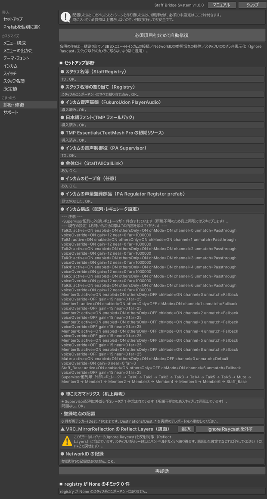
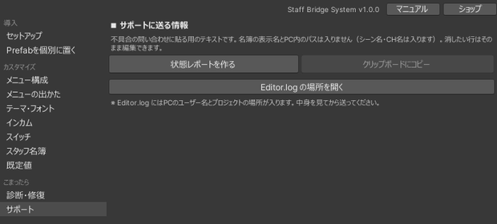

# トラブルシューティング

!!! tip "まずは診断を実行してください"
    **Tools ＞ MGR ＞ Staff Bridge System ＞ セットアップ ＞ 診断・修復** を開いて実行します。参照の設定漏れ、必須オブジェクトの不足、前提パッケージの未導入など、よくある不具合の多くはここで検出でき、ボタンで修復できます。

---

## メニューの文字が表示されない

**原因**: 日本語フォント `net.narazaka.vrchat.tmp-fallback-fonts-jp` が未導入です。

文字が豆腐（□）になるのではなく、フォント参照そのものが欠落した状態になります。すでに別の日本語 TMP フォールバックを設定している環境でも、参照しているフォントアセットが異なるため代替にはなりません。

**対処**: VCC / ALCOM で導入してからシーンを再読み込みしてください。セットアップウィンドウの「導入ページを開く」ボタンからも配布元を開けます。

**導入済みなのに出ない場合**: TMP Essentials が未インポートの可能性があります。`Assets/TextMesh Pro/` フォルダが無ければ、**Window ＞ TextMeshPro ＞ Import TMP Essential Resources** を実行してください。この状態では診断が「日本語フォント: 導入済み」と表示するため、診断だけでは気づけません。詳しくは [導入](install.md#tmp-essentials) を参照してください。

---

## メニューが開かない

- **スタッフになっていない**可能性があります。メニューはスタッフ状態のプレイヤーだけが開けます。一覧ボードや頭上マーカーで自分がスタッフになっているか確認してください。
- **長押しが足りていない**可能性があります。既定では 0.5 秒の長押しが必要です。VR は右スティックを下に倒して長押し、Desktop は既定 Tab キーの長押しです。
- Desktop キーが他のギミックと競合している場合は、`StaffMenuShell` の「Desktop開閉キー」を変更してください。

---

## スタッフにならない

- **表示名が名簿と完全一致していない**ことが最も多い原因です。前後の空白、全角半角、絵文字の有無を確認してください。
- 名簿を編集した後、ワールドを**再アップロード**していない可能性があります。名簿はワールドに焼き込まれます。
- 途中入室でも名簿による付与は働きます。反映されない場合は、誰かが入退室すると名簿が配り直されて揃うことがあります。
- 応急処置として、スタッフ切替スイッチでその場でスタッフにできます。

---

## インカムの音声が聞こえない

### 特定の人だけ聞こえない

その人が**同じチャンネルに参加していない**可能性が高いです。メニューのメンバー一覧で参加状況を確認してください。チャンネルを入り直すと復帰します。

チャンネル参加と名簿は、同期の取りこぼしを検出すると自動で再送する仕組みが入っています（3秒間隔で最大3分間）。それでも直らない場合は Rejoin してください。

### 全員聞こえない

- FukuroUdon が未導入のまま生成された可能性があります。診断で確認してください。
- 音声基盤（PA Supervisor）が複数存在すると、プレイヤータグを取り合って正しく動作しません。診断が複数検出した場合は1つに統合してください。

### スタッフ以外に聞こえてしまう

「スタッフ限定モード」が OFF になっていないか確認してください。この設定はワールドに焼き込まれるため、変更後は再アップロードが必要です。

「診断・修復」ページの「インカム聴こえ方マトリクス検査」で、設定した構成での聴こえ方をエディタ上で事前確認できます。

## メニューを閉じるとインカムが使えない

インカム本体が**常に Active な GameObject** の下に置かれていない可能性があります。メニュー配下に置くと、メニューを閉じた時点で動作が止まります。

StaffIncomRadio を選択すると、Inspector に注意書きが出ます。その場合は、メニューの外にある常に Active な GameObject へ手動で移動してください。

---

## インカム設置時に警告が出る

FukuroUdon はバージョンによって内部のフィールド名が変わることがあります。本製品はリフレクションで連携しているため、動作確認済みの **3.19.5** の利用を推奨します。

---

## 共有タイマーが開始できない・時間が増えない

**原因**: 名簿（StaffRegistry）が割り当てられていない可能性があります。同梱の Prefab を手で置いた構成では、Prefab がシーン内の名簿を参照として持てないため、配置後のリンクが必要です。

**対処**: **診断・修復ページ ＞ 必須項目をまとめて自動修復** を実行してください。タイマーとスイッチへの名簿の割り当てもここで行われます。

共有タイマーの開始と取消は**2回押し**です。1回目でボタンの文言が変わり、既定 5 秒以内にもう一度押すと確定します。時間内に押さないと取り消されるため、1回しか押していない場合は始まりません。

---

## スイッチを押しても何も起きない

- **イベント名が違う**可能性があります。スペルミスや大文字小文字の違いはコンパイルエラーにならず、無音で失敗します。スイッチページの **イベント名** を送り先の実装と突き合わせてください
- **他の人の画面では何も起きない**場合、それは仕様です。イベントが送られるのは押した本人のクライアントだけで、全員へ届けるかどうかは送り先が決めます。同梱の `StaffObjectToggle` なら **同期する** を ON にしてください。それ以外のギミックは、そのギミック側の作りによります（[リファレンス](reference.md#trigger-global)）
- 送り先のギミックが、あとから入室した人にも同じ状態を配る作りになっているかは、送り先側の責任です

---

## 通知ログが出ない・邪魔になる

- 出るのは**スタッフだけ**です。スタッフ状態を確認してください
- 各自の設定タブで「表示しない」を選んでいると出ません。位置は左下から選べます
- 人の出入りが多くて流れすぎる場合は、`StaffNoticeLog` の **入退室を表示する** を OFF にすると入退室が載らなくなります
- 1件あたりの表示時間は `StaffNoticeLog` の **表示秒**（既定 20）で変えられます

---

## テーマを適用しても色が変わらない

- **プレイモード中は適用できません**。プレイ中の変更はプレイ終了時に元へ戻るため、ボタンが無効化されます。
- 塗り替えはテーマの色と一致する要素のみを対象にします。生成時と別の色を手動で塗った要素は変更されません。

---

## アップロード時に警告ダイアログが出る

StaffRegistry の**「ログ出力する」が ON** になっています。公開後もスタッフの表示名が Console に出続けるため、通常は OFF を推奨します。

警告のみで、アップロードはそのまま続行されます。

---

## Desktop のキーを押すと別の操作も一緒に動く

同じキーが2つの機能に割り当てられています。「診断・修復」ページの**Desktopキーの割り当て**が次を検出します。

| 検出するもの | 何が起きるか |
|---|---|
| メニュー開閉キーとの重複 | キー候補の `B` や `G` はメニューの開閉キーの選択肢にもあります。同じキーだと、押すたびにメニューが開閉しながら発話が始まります |
| VRChat 本体の操作との重複 | `V`（マイク）・`C`／`Z`・WASD・Space・Shift・Ctrl・Esc・Enter・Tab など。押すと本来の操作も一緒に動きます |
| キー候補どうしの重複 | 同じキーのボタンが設定タブに2つ並びます |
| 候補の1つ目が OFF でない | OFF を選んだつもりで発話キーが生きたままになります |
| インカムとメガホンの初期キーが同じ | 同じキーには両方を割り当てられないため、メガホン側が OFF で始まります |

キー候補は「既定値」ページから差し替えられます。

なお、インカムとメガホンに同じキーを選んだ場合は、**あとから選んだ側が優先**され、もう片方は自動で OFF になります。1回の押下で両方が動くのを避けるためです。

!!! note "予約キーの一覧は網羅ではありません"
    確実に重なるものだけを挙げています。ここに出ていないキーでも、VRChat 側の操作と重なる可能性はあります。実機で一度お試しください。

---

## 生成や診断が動かない

**フォルダの中身の構成を変えている**と参照できません。`Prefabs` / `Audio` / `Samples` などのサブフォルダごと移動していないか確認してください。

インポートしたファイルの一部だけを削除している場合も同様です。unitypackage を再インポートして復元してください。

---

## 解決しない場合

BOOTH のメッセージ機能からご連絡ください。

「診断・修復」ページの一番下にある **サポートに送る情報** で「状態レポートを作る」を押すと、調査に必要な情報が文章としてまとまります。「クリップボードにコピー」でコピーして、メッセージに貼り付けてください。

- レポートに含まれるもの: 本製品・Unity・VRChat SDK・FukuroUdon のバージョン、診断結果、設置数、チャンネル構成、音声レギュレータの並び順、名簿の件数
- **含まれないもの**: スタッフの表示名、PC 内のパス、ワールド ID
- シーン名・チャンネル名など、ご自身で付けた名前は含まれます。内容はその場で編集できるので、送りたくない行は消してからコピーしてください

レポートを作るボタンはシーンに何も書き込みません。外部への送信も行いません。

あわせて、Console に出ているエラーメッセージがあれば添えてください。
