# 基本の使い方

ここではワールドに入ってからの操作を説明します。

## スタッフになる

スタッフになる方法は3通りです。

**名簿による自動 ON**
StaffRegistry の「初期スタッフ名一覧」に登録された表示名のプレイヤーは、ジョイン時に自動でスタッフになります。表示名は完全一致で判定されるため、前後の空白や表記ゆれに注意してください。

**スタッフ切替スイッチ**
シーンに置かれたスイッチをインタラクトすると、押した本人のスタッフ状態が ON / OFF します。スイッチには現在の状態が表示されます。

!!! warning "スイッチの置き場所"
    スイッチに触れれば誰でも自分をスタッフにできます。一般公開ワールドでは、スタッフ控室などスタッフ以外が入れない場所に置いてください。

**スタッフ管理タブから付与**
常設スタッフが、メニューの[スタッフ管理タブ](#staff-manage)から在室者を当日スタッフにできます。外すのも同じ場所です。

スタッフになると、設定に応じて頭上にマーカーが表示されます。

## メニューを開く

| 環境 | 操作 |
|---|---|
| VR | 右スティックを下に倒して長押し |
| Desktop | キーを長押し（既定は Tab キー） |

長押しの時間は既定 0.5 秒です。Desktop のキーは Tab / F1 / F2 / F3 / F4 / B / G / N から選べます。

メニューは**開いた瞬間の頭の前方に固定**されます（その後は追従しません）。既定では視線のやや下・少し小さめに表示され、接客中に正面の視界を塞ぎにくくしてあります。開いた場所から離れると自動的に閉じます。

ヘッダーの右上には製品名とバージョンが表示されます。不具合を問い合わせるときは、この表示を伝えると調査が早く進みます。

メニューは次のタブで構成されています。

| タブ | 内容 |
|---|---|
| テレポート | 登録地点・在室スタッフへの移動 |
| インカム | チャンネルの参加と発話、メガホン |
| メッセージ | 定型文の一斉送信と受信ログ |
| タイマー・ログ | 共有タイマー・ローカルタイマー・ストップウォッチ・入退室ログ |
| ノート | 進行台本の閲覧と、自分だけの走り書きメモ |
| スイッチ | ワールド内のギミックへイベントを送る |
| 設定 | 音量・UI サイズ・発話方式・通知ログの個人設定 |
| スタッフ管理 | 当日スタッフの追加と削除（常設スタッフのみ） |

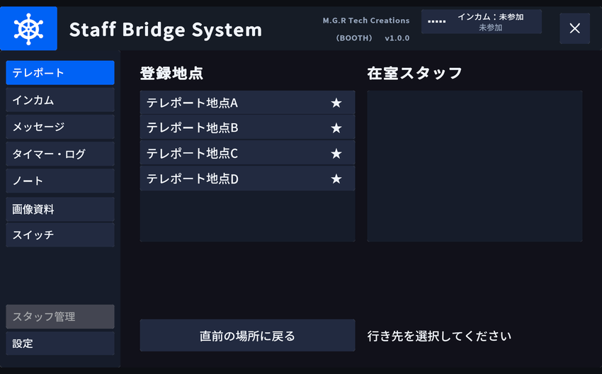

「スタッフ管理」タブが薄いのは、常設スタッフ以外には開けないためです。

使わないタブは非表示にできます。並び順も変えられます（[メニュー構成](howto.md#menu-config)）。タブが8枚あるときは2段で表示されます。

表示位置・大きさ・開閉操作はすべて Inspector で調整できます（[設定リファレンス](reference.md#menu-shell)）。

## テレポート { #teleport }

テレポートパネルには「登録地点」と「在室スタッフ」が並びます。

1. 行き先を選ぶ（選択された行にハイライトが付きます）
2. 確定ボタンを押す

誤操作を防ぐため、選択と実行は2段階に分かれています。

- **お気に入り**: 各行の ★ を押すと一覧の上部に固定されます。インスタンス内でのみ有効で、退室するとリセットされます（スタッフのお気に入りは16人まで）。
- **着地位置**: 人が重ならないよう、目標地点を中心に少しばらついた位置に降ります（登録地点・在室スタッフのどちらも同じ）。
- **在室スタッフへの着地**: 相手の**背後**に降り、着地後は相手と同じ向きを向きます。接客中の相手やスタッフ以外の視界に割り込まないための挙動です。
- **直前の地点へ戻る**: 押すたびに、現在地と直前の地点が入れ替わります。この移動だけはばらつかず、元の位置へ正確に戻ります。

## インカム { #incom }

### チャンネルに参加する

インカムパネルでチャンネルを選んで参加します。距離に関係なく声が届くのは、同じチャンネルに参加しているメンバーだけです。

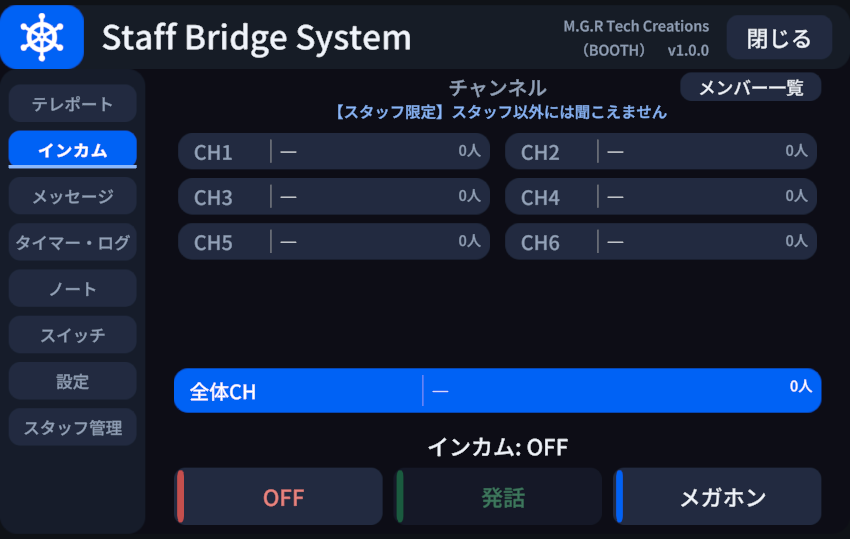

**スタッフ限定モード**（既定 ON）では、送信中の声が届くのは同じチャンネルのメンバーだけです。スタッフ以外や別チャンネルのスタッフには届きません。この設定はワールドに焼き込まれ、インスタンス全員に一律で適用されます。

!!! warning "スタッフ限定モードを OFF にした場合"
    インカムでは同じチャンネルにしか届きませんが、**近くにいる人には距離減衰のある通常の声として聞こえます**。運営連絡をスタッフ以外に聞かれたくない場合は、既定の ON のまま使ってください。

### 話す

| 方法 | 操作 |
|---|---|
| 発話ボタン | メニュー上のボタンを**押している間だけ**送信されます（トランシーバーと同じ方式） |
| VR ジェスチャー | **右手**を体の指定位置（既定は耳）に近づけてトリガーを引きます |

どちらも押している間だけ声が届きます。手を離す（ボタンから指を離す）と送信が止まります。発話ボタンは[設定タブ](#settings)でトグル（押すたびに ON / OFF）にも変更できます。Desktop では、発話ボタンの代わりにキーを使うこともできます。

VR ジェスチャーの位置は耳・肩・胸元から選べます。判定範囲の半径も調整可能です。使う手はインカム＝右手・メガホン＝左手で固定です。

発話をやめてから実際に送信が切れるまで、わずかな待ち時間（既定 0.3 秒）があります。語尾が切れるのを防ぐためです。また、押しっぱなしの事故を防ぐため、既定 120 秒で強制的に送信が切れます。

チャンネルを変えたとき、チャンネルから抜けたとき、スタッフでなくなったときも、送信はその場で切れます。

!!! info "メニューを閉じても発話できます"
    インカム本体は常に Active な GameObject の下に置かれているため、メニューを閉じた状態でも VR ジェスチャーでの発話は機能します。

同じチャンネルでは複数人が同時に話せます（全二重）。送信の順番待ちは発生しません。

### 表示

- 誰が話しているかが発話者表示に出ます
- 自分の受信チャンネルで誰かが話し始めた／全員が話し終えたときに、小さな受信音が鳴ります

「メンバー」を押すと、どのチャンネルに誰が入っているかを一覧できます。

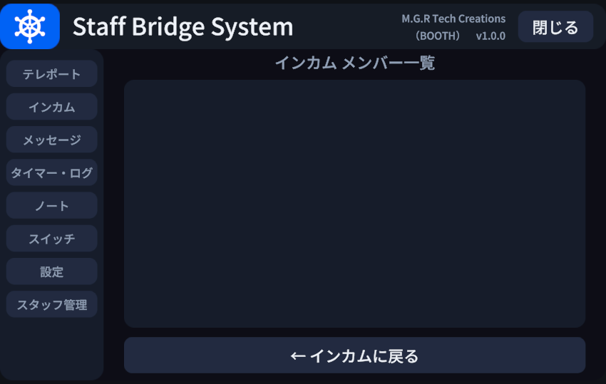

## メガホン { #megaphone }

拡声している間だけ、距離に関係なく**インスタンス内の全員（スタッフ以外を含む）**へ声が届きます。始め方は3通りで、インカムパネルのメガホンボタンの**長押し**（既定 0.5 秒）、設定タブで割り当てた **Desktop キー**、VR では**左手**を耳（設定した位置）へ近づけてのトリガーです。

スタッフ以外へ呼びかける場面（開場・終了案内、誘導）を想定した機能です。インカムが「スタッフ以外に聞かせない」ための仕組みであるのに対し、メガホンはその唯一の例外なので、事故が起きにくいように次の制約があります。

- ボタンからの起動は長押し。誤タップでは始まりません
- 長押し方式と VR ジェスチャーは、離した時点で止まります（切り忘れが起きません）
- トグル方式はメニューを閉じても続きます。視界のステータス表示と最大使用秒が保険です
- インカムの送信中はメガホンを起動できず、メガホン使用中はインカムを送信できません
- スタッフでなくなった時点で即座に切れます
- 既定 180 秒で強制的に切れます
- 使用中は視界のステータス表示に出ます

## 一斉メッセージ { #broadcast }

定型文を選んでスタッフに送信します。

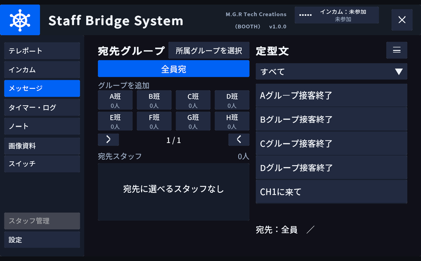

- **宛先**: 全スタッフ／宛先グループ／個別に選んだスタッフ。グループと個人は**まとめて選べます**（「A班・B班 ＋ 2名」のように送れます）
- **重複しません**: 複数のグループに所属している人や、グループ宛と個別指定の両方に当てはまる人にも、届くのは1通だけです
- **宛先グループ**: 自己申告制のグループ（既定は A班〜H班）です。自分の所属はメッセージタブの「所属グループを選択」から決め、再入場後も引き継がれます。複数のグループに入れます。誰も居ないグループは選べません
- **受信側**: 視界の隅の[通知ログ](#notice-log)に1行として流れ、通知音が鳴ります。全文はメッセージタブの受信ログページで読み返せます
- **自分宛の強調**: 個別に指名されたメッセージには目印が付き、通知ログでは枠が付いて長めに残ります（全員宛には付きません）
- **送信確認音**: 送信した本人にだけ鳴ります

### 宛先グループに入る

グループ宛のメッセージは、**そのグループに入っている人にだけ**届きます。誰がどのグループかは自己申告制で、メッセージタブの「所属グループを選択」から自分で決めます。

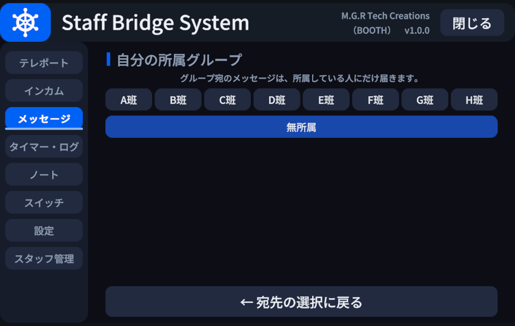

- 班のボタンは押すたびに入る／抜けるが切り替わります。**いくつでも掛け持ちできます**
- 「無所属」を選ぶと、どのグループ宛も受け取らなくなります
- 選んだ所属は再入場後も引き継がれます
- 宛先グループのチップには現在の人数が出ます。**誰も居ないグループは選べません**（黙って誰にも届かない送信を防ぐため）

掛け持ちしていても、届くメッセージは1通だけです。

### 受信ログを読み返す

「ログを開く」を押すと、受け取ったメッセージを新しい順に一覧できます。通知ログは数十秒で流れて消えますが、ここには残ります。

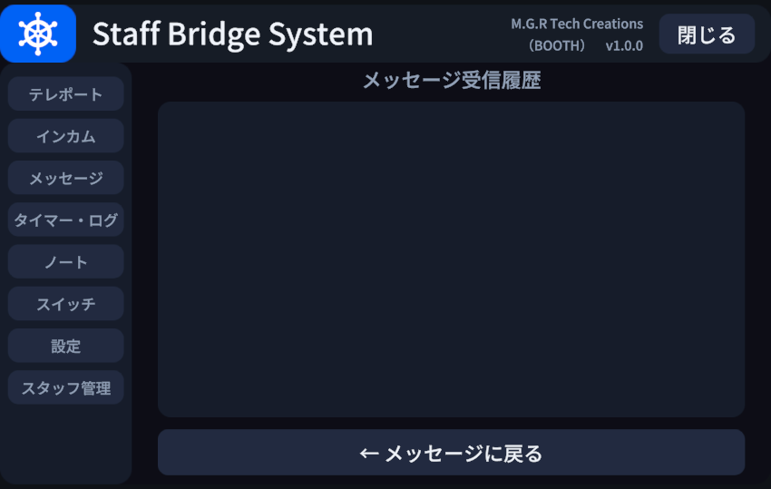

- 行の形式は「時刻 送信者: 本文」です。時刻は受け取った側の時計です
- 既定で16件まで残ります（Inspector の `StaffBroadcast` ＞ 履歴件数）
- 自分宛に指名されたメッセージには目印が付きます
- 記録は各自の端末に残るもので、入室前のメッセージは含まれません

定型文は最初から15件（接客／CH誘導／移動／指示のカテゴリ）が入っています。内容とカテゴリは専用の編集ウィンドウから自由に変更できます（[運用ガイド](operation.md#broadcast-presets)）。

!!! note "送信先はスタッフのみです"
    スタッフ以外へメッセージを表示する機能はありません。また、送信より後に入室した人には過去のメッセージは表示されません（[運用ガイド](operation.md#late-join)）。

## 通知ログ { #notice-log }

メッセージの受信・タイマーの到達・入退室・スタッフ権限の変化・スイッチの発火は、**視界の隅に出る1本のログ**にまとめて流れます。スタッフにだけ見えます。

- 行の左端の色帯が種別を示します（メッセージ／タイマー／システム／入退室）
- 本文は省略されず、長い文は欄の幅で折り返します
- 新しい行ほど濃く表示され、古い行は薄くなって奥へ下がります
- 最大5件。1件あたり 20 秒（自分宛のメッセージは枠が付いて 40 秒）で消え、全部消えると欄ごと見えなくなります

出す位置は各自が[設定タブ](#settings)から左下・表示しないの2つから選べます。メニューを開いていなくても表示されます。

!!! note "読み返しはメニューから"
    通知ログは「いま流れている連絡」を出すためのものです。過ぎたメッセージはメッセージタブの受信ログ、入退室はタイマー・ログタブから読み返してください。

## タイマー・ログ { #timer }

進行の時間管理と、入退室の記録をまとめたタブです。

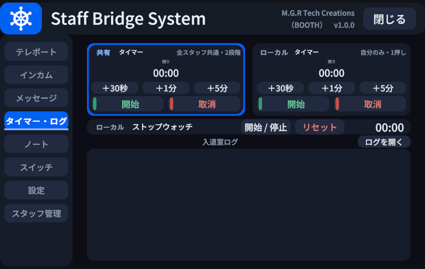

**共有タイマー**は、インスタンスの全員に同じ残り時間が見えます。＋1分／＋5分／＋10分で時間を積み、開始すると減っていきます。誤操作を防ぐため、**開始と取消は2回押し**です（1回目でボタンの文言が変わり、既定 5 秒以内にもう一度押すと確定します）。0 になると通知ログに「共有タイマー ◯分が経過しました」と出ます。

**ローカルタイマー**は自分だけのタイマーです。他のスタッフには見えず、確認の2回押しもありません。**ストップウォッチ**も自分専用で、経過時間を計ります。

**入退室ログ**には、誰がいつ入室・退室したかが記録されます。入室は緑、退室は赤の文字色です。タブ上では最新6行が見え、見出し右の「ログを開く」を押すと全画面の一覧ページが開きます。

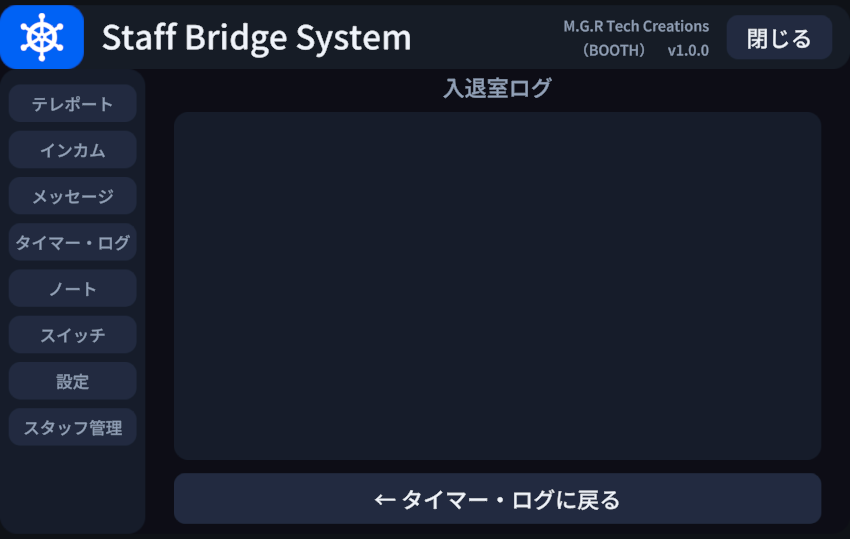

!!! note "ログは自分の端末の記録です"
    入退室ログは各自の端末で記録されます。自分が入室する前の出入りは含まれません。

## ノート { #note }

進行台本やチェックリストを、ワールド内で読むためのタブです。

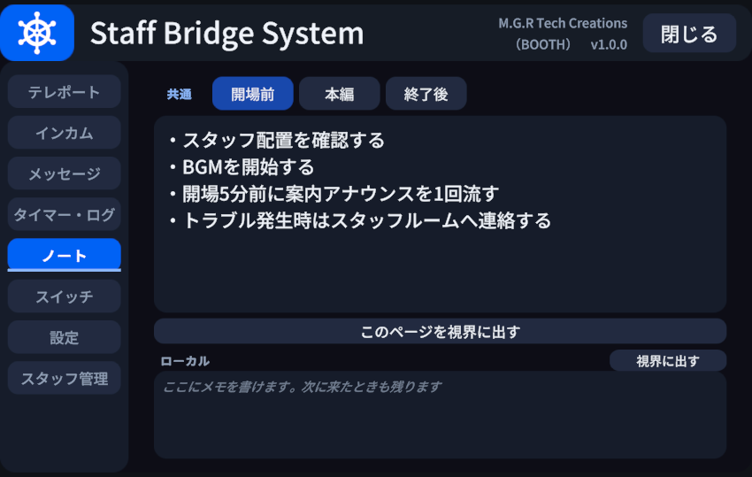

- **ページ**: 上のボタンでページを切り替えます（既定は「開場前」「本編」「終了後」の3ページ）。内容とページ名は Unity 側で自由に書き換えられ、**全スタッフに同じものが見えます**
- **メモ欄**: 下の入力欄は自分だけの走り書きです。他のスタッフには見えません。打った内容は再入場後も引き継がれます
- **視界ノート**: ノートの1ページを視界の右下に出しておけます。メニューを閉じたままでも読めます。出すものは「出さない（既定）」「共有ページのどれか1つ」「自分のメモ」の3択で、文字の大きさは[設定タブ](#settings)で小・中・大から選べます。選択と大きさは再入場後も引き継がれます

## スイッチ { #switch }

手元から、ワールド内のギミックへイベントを送るタブです。開場ゲートを開ける、演出を出すといった操作を、その場所まで行かずに実行できます。

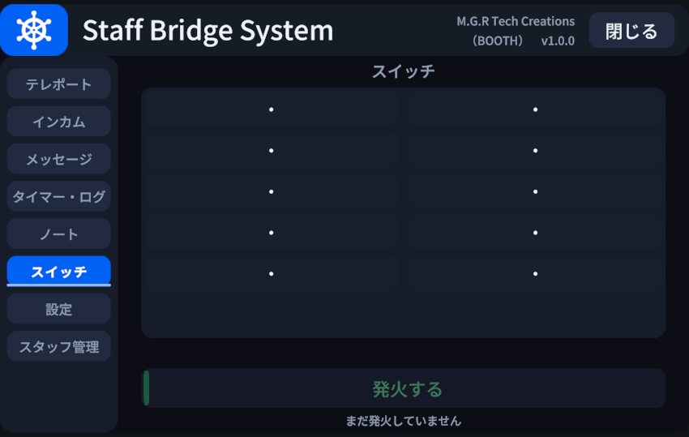

- 行を選んでから確定ボタンを押す2段階の操作です
- 何が並ぶか（ボタン名と送り先）はワールド制作者が決めます
- 11件目からは右端の ▲▼ で送ります（10件までは送りボタンが出ません）
- 最後に発火した内容がパネルに表示され続けます。あとから入ったスタッフにも同じ表示が見えます

!!! note "押した結果は送り先のギミック次第です"
    このタブが保証するのは「イベントを1回送る」ところまでです。送り先が全員の画面で同じ状態になるかどうかは、送り先のギミックの作りによります。同梱の `StaffObjectToggle` を使う場合は、**同期する**の ON / OFF でグローバル・ローカルを選べます。サンプルワールドの STEP 8 には、その両方（ビーコン柱＝グローバル／空の色＝ローカル）を置いてあります。

## 設定 { #settings }

設定タブの内容は**自分にだけ効く**個人設定です。他のスタッフには影響しません。選んだ値は VRChat の PlayerData に保存され、同じワールドへ再入場したときに復元されます。

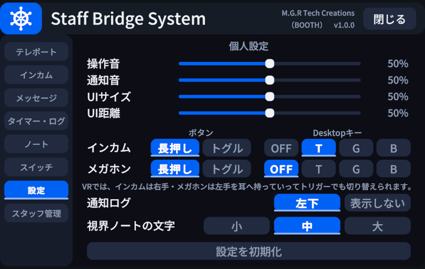

| 項目 | 内容 |
|---|---|
| 操作音 | UI 操作音・インカムの送受信音・メッセージ送信音の音量 |
| 通知音 | インカムの受信ビープ・メッセージ通知音の音量 |
| UI サイズ | メニューの大きさ（50〜150%）。開いている最中も即座に反映される |
| UI 距離 | メニューを出す距離（70〜160%）。開いている最中も即座に反映される |
| ボタン | インカム・メガホンそれぞれの発話ボタンの方式。長押しかトグル |
| Desktop キー | インカム・メガホンそれぞれで、ボタンの代わりに使うキー |
| 通知ログ | [通知ログ](#notice-log)を出す位置（左下／表示しない） |
| 視界ノートの文字 | [ノート](#note)を視界に出したときの文字の大きさ（小／中／大） |

「ボタン」と「Desktop キー」は、**インカムとメガホンを行に、設定を列にした表**になっています。インカムをトグルにしつつメガホンは長押しのまま、といった組み合わせが選べます。メガホンの Desktop キーの既定は割り当てなしです。使う人が自分で決めます。同じキーを両方に割り当てることはできず、あとから選んだ側が優先されてもう片方が OFF になります。

いずれも「設定を初期化」ボタンで既定値に戻せます。音量を分けてあるのは、操作音は絞りたいが着信は聞き逃せない、という運用があるためです。

!!! warning "トグル発話について"
    トグルにすると、**メニューを閉じても送信が続きます**。切り忘れの保険として、視界のステータス表示に送信中であることが出続け、最大送信秒を超えると強制的に切れます。VR の耳元ジェスチャーは、この設定に関わらず常に長押しです。

Desktop キーは Desktop 専用です（VR では無効）。既定の候補は なし / T / G / B で、ワールド制作者が候補を差し替えられます。メニュー開閉キーや VRChat 標準の操作と衝突しないキーが選ばれています。

## スタッフ管理 { #staff-manage }

在室者を当日スタッフにする操作と、当日スタッフを外す操作を、ワールド内から行えます。

このタブが使えるのは、**常設スタッフで、かつ現在スタッフ ON の人**だけです。他の人にはタブが表示されません。

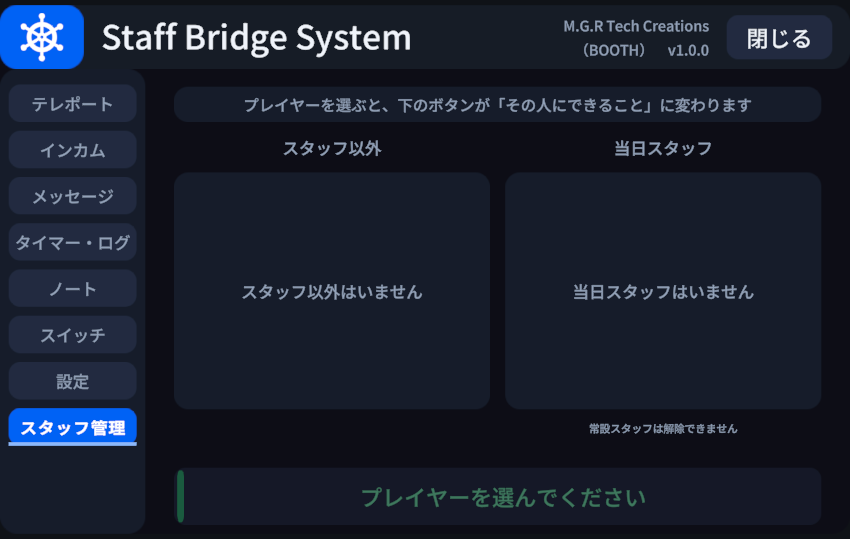

| 一覧 | 内容 |
|---|---|
| 左（在室者） | まだスタッフでない在室者。選んで確定すると当日スタッフになる |
| 右（当日スタッフ） | このタブやスイッチでスタッフになった人。選んで確定すると外せる |

- 常設スタッフは**どちらの一覧にも出ません**。外せるのは当日スタッフだけです
- 操作は「行を選ぶ → 確定ボタンを押す」の2段階です。入退室で行の中身が入れ替わった瞬間に別人へ操作してしまう事故を防ぐため、一覧が作り直されるたびに選択は解除されます
- 一覧に収まらない人数は「他 N 人」と表示されます

## スタッフ限定オブジェクト { #staff-only }

配置済みのオブジェクトは、スタッフ状態に応じて自動的に切り替わります。

| 種類 | 挙動 |
|---|---|
| スタッフ専用スイッチ | スタッフだけが操作できる。非スタッフが押すと「スタッフ専用です」と表示される |
| スタッフゲート | 非スタッフだけが通れない壁 |
| スタッフだけ見えるオブジェクト | スタッフのときだけ表示（逆も設定可能） |
| 在室スタッフ一覧ボード | 入室中のスタッフ名を常時表示 |
| 頭上マーカー | スタッフの頭上に目印を表示 |
